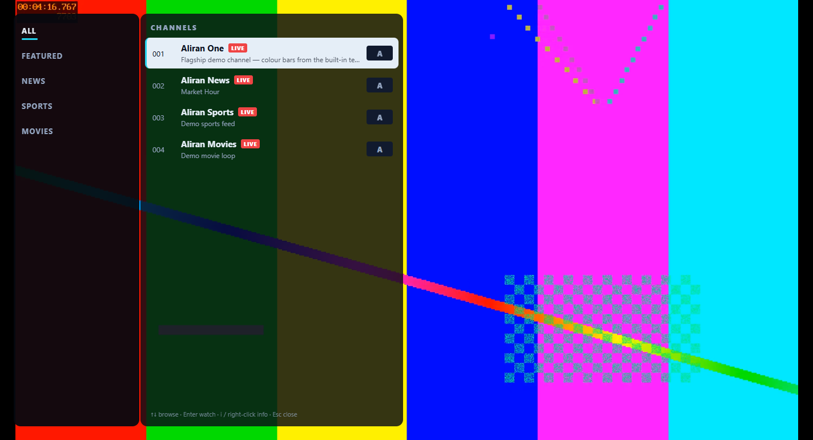

# Aliran

[](https://github.com/AbueloSimpson/aliran/actions/workflows/ci.yml)
[](https://abuelosimpson.github.io/aliran/)
[](https://www.npmjs.com/package/@aliran/player-sdk)
[](https://github.com/AbueloSimpson/aliran/releases/latest)
[](LICENSE)

**Aliran** (Malay/Indonesian: *flow / stream / current*) — a self-hostable,
open-source, **peer-to-peer OTT streaming platform** built on the
[Holepunch/Pear](https://pears.com) stack. Streams flow peer to peer: viewers
re-seed each other, so there are **no central media servers** and near-zero
bandwidth cost.



*Screenshots show demo channels from the broadcaster's built-in `test` source
(colour bars) — every UI element is real.*

> **Status: pre-1.0, actively developed — and running for real.** The full pipeline is
> verified end to end on live infrastructure **over the public DHT**: panel +
> broadcaster deployed on a small VPS via the provided Docker pack, dozens of
> channels ingested 24/7 from real sources, and the Android app (phone + TV) and
> the Windows desktop player logging in and playing live P2P video against it —
> with the same player packaged for macOS, keyless **public viewer builds** on the
> [releases page](https://github.com/AbueloSimpson/aliran/releases/latest), the
> engine published on npm, web admin dashboards for both server components, and a
> remote acceptance harness that proves a deployment from anywhere. See the
> [Roadmap](ROADMAP.md) for what's done vs. planned, [CHANGELOG.md](CHANGELOG.md)
> for the shipped-feature summary, and each package's `README.md` for details.

## Get the apps (viewers)

Keyless **public builds** of every viewer are on the
**[releases page](https://github.com/AbueloSimpson/aliran/releases/latest)** —
Windows (installer + portable exe), macOS (Apple silicon + Intel, dmg/zip), and
one Android APK that covers phone **and** Android TV. On first run each app shows
a **Connect screen**: enter the three things an Aliran operator hands out — the
**panel public key**, a **username**, and a **password** — and the app finds the
service over the P2P network. No URLs. Install steps (including the unsigned-build
warnings each OS shows) are in the
[desktop viewer guide](docs/desktop-viewer-guide.md) (Windows + macOS) and the
[Android viewer guide](docs/android-viewer-guide.md).

There is no public demo service: Aliran is infrastructure for operators. You
connect the apps to your own deployment (Quickstart below) or to a service
someone runs for you.

## What it is

Cooperating peer-to-peer components (all serverless in transport — they find
each other over the Hyperswarm DHT by public key):

| Component | Runs on | Role |
|-----------|---------|------|
| **[`panel/`](panel/)** | Linux / desktop | Origin of truth: signed account DB + stream catalog, OPRF login (brute-force resistant), entitlement tokens |
| **[`broadcaster/`](broadcaster/)** | Linux (headless) | Ingests the original stream (OBS/RTSP/HLS/file) → encrypted P2P feed, seeds the swarm |
| **[`repeater/`](repeater/)** | Linux (headless) | Optional **keyless** regional super-peer (Open-Connect model): mirrors + serves encrypted feeds, absorbs viewer fan-out, cannot watch what it serves |
| **[`library/`](library/)** | Linux (headless) | Optional **VOD service**: one-shot ingest of video files → encrypted, P2P-seeded on-demand titles with full seek, granted like channels |
| **[`client/`](client/)** | Android (phone + TV) | The app/APK: logs in, browses an OTT UI, plays the stream, **and re-seeds to other viewers** |
| **[`desktop/`](desktop/)** | Windows & macOS | The desktop player (Electron): the same OTT interface and P2P engine on a PC — Windows installer/portable exe, macOS dmg/zip |
| **[`sdk/`](sdk/)** | anywhere Node runs | The published engine — [`@aliran/player-sdk`](https://www.npmjs.com/package/@aliran/player-sdk) (with `@aliran/core` and `@aliran/react-native`): build your own client or headless viewer on the exact engine the apps run |

```
 ORIGIN (OBS/RTSP/HLS)      Hyperswarm DHT (find peers by public key)
        │                ┌───────────────┬───────────────────────────┐
        ▼                │               │                           │
  broadcaster ──encrypted feed──►  viewer app ◄──re-seed──► viewer app
        │                                ▲       (Android / Windows / macOS)
        └── registers stream ──►  panel  │  login + catalog + entitlement
                                  (accounts, catalog, OPRF)
```

## Why P2P / why this design

- **No infrastructure cost at scale** — clients distribute to each other.
- **Runs behind a firewall** — the panel needs no public IP or open ports (DHT hole-punching); optional relay-only mode hides its origin IP.
- **Self-hostable & brandable** — every operator generates their own keys and config; nothing is hardcoded to a single deployment.
- **Security by secrets, not obscurity** — public code, per-deployment keys. See [`docs/security-model.md`](docs/security-model.md).

## Quickstart

```bash
# 1. Panel (origin of truth)
cd panel && cp .env.example .env && npm install
node src/admin-cli.js init            # generate panel + OPRF keys
node src/admin-cli.js create-user alice
node src/index.js                     # start the panel node

# 2. Broadcaster (content origin)
cd ../broadcaster && cp .env.example .env && npm install
node src/index.js                     # ingest -> encrypted Hyperdrive -> swarm

# 3. Client (Android app) — see client/README.md for the native build
```

For a real deployment, run the server stack with **Docker Compose** (the supported
path — pinned ffmpeg/Node, auto-restart, host networking pre-configured) — see the
[operator guide](docs/operator-guide.md).

## Features

- Live P2P streaming (HLS-over-Hyperdrive), viewers re-seed each other
- Phone **and** Android TV from one codebase, plus Windows & macOS desktop players
  on the same engine
- Username/password login validated against a **panel-signed** P2P database
- Brute-force resistance (OPRF + throttling), device limits, long-TTL sessions
- OTT-style GUI: splash auto-auth, menu hub, fullscreen live TV with overlay browsing,
  favorites/search, D-pad navigation on TV — white-label themable
- **Program guide**: on-demand EPG (now/next lines in the channel list + a full
  guide panel) fetched from operator URLs — schedules never bloat the P2P catalog
- In-player **subtitle/CC and audio-track selection**, plus a "smooth zapping"
  prefetch toggle for instant channel changes
- **Mobile-honest networking**: on cellular/metered connections the app stops
  re-seeding and throttles prefetch — viewers never burn upload data on a data plan
- Web admin dashboards: panel (users, streams, grants, art, curation) and broadcaster
  (channels, push/pull ingest, transcode incl. GPU, ffmpeg logs)
- Resilient ingest: crash/stall watchdog, backup sources, and an **offline slate** — a
  channel whose source dies loops a "SOURCE OFFLINE" card and auto-recovers, never going
  blank
- **Redirect channels**: catalog entries that play an operator's CDN/HLS URL
  directly — no P2P feed behind them
- Self-healing playback: tune watchdog, wedged-connection teardown, live-edge stall
  resync — plus optional keyless **repeater** super-peers to absorb fan-out
- **VOD**: the optional `library/` service — file → encrypted, P2P-seeded on-demand
  titles with full seek, granted like channels
- **White-label**: brand overlays (name, colors, logo, wallpaper, TV banner) and
  per-operator custom builds for Android and desktop — the
  [operator build walkthrough](docs/operator-build-walkthrough.md) goes from your
  keys to a branded APK and exe
- **No DRM, by design**: content protection is transport encryption + per-user sealed
  keys + key rotation — honest access control, not studio-grade DRM. The
  [security model](docs/security-model.md) spells out exactly what that does and
  doesn't defend against

## Documentation

Browse online at **<https://abuelosimpson.github.io/aliran/>**, or start at
[`docs/README.md`](docs/README.md). Highlights:
[Getting started](docs/getting-started.md) ·
[Architecture](docs/architecture.md) ·
[Security model](docs/security-model.md) ·
[Operator guide](docs/operator-guide.md) ·
[Configuration](docs/configuration.md) ·
[Player SDK](docs/sdk.md) ·
[Desktop viewer guide](docs/desktop-viewer-guide.md) ·
[Android viewer guide](docs/android-viewer-guide.md) ·
[Operator build walkthrough](docs/operator-build-walkthrough.md) ·
[Knowledge base](docs/kb/index.md) ·
[FAQ](docs/faq.md).

## Roadmap

See [`ROADMAP.md`](ROADMAP.md) for the path from alpha to a production-ready 1.0
(streaming → auth/OTT UI → HA/hardening) and what's deliberately out of scope.

## Support

Aliran is free and open source. If it's useful to you and you'd like to help fund
its development, you can buy me a coffee:

[](https://ko-fi.com/abuelosimpson)

Every contribution is appreciated and goes toward the work on the
[Roadmap](ROADMAP.md).

## ⚠️ Content-rights disclaimer

Aliran is neutral infrastructure. **Operators are solely responsible** for holding
the rights to any content they stream and for complying with content-licensing and
regional/legal requirements in the territories they serve. See
[`docs/legal-compliance.md`](docs/legal-compliance.md).

## License

[MIT](LICENSE) — see the file for details. Free for any use: edit it, redistribute
it, or use it commercially.
