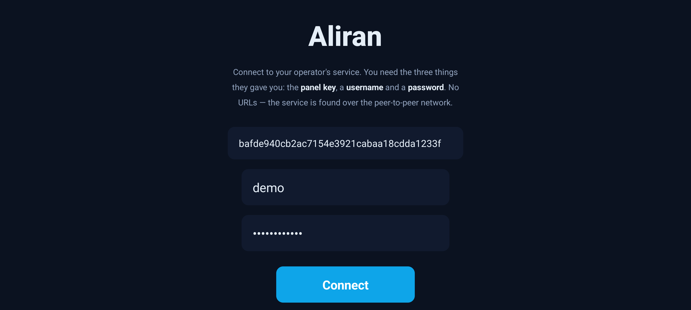
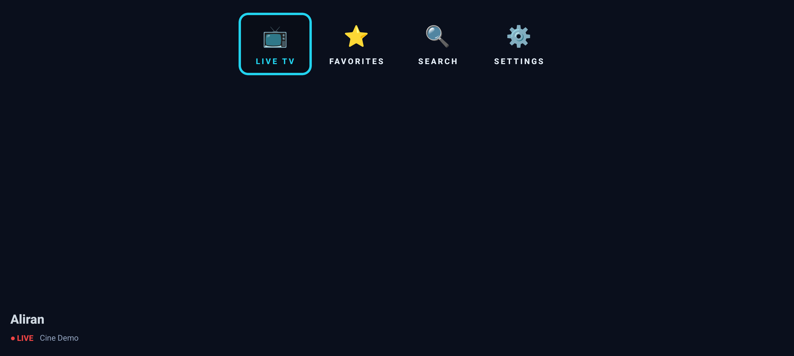
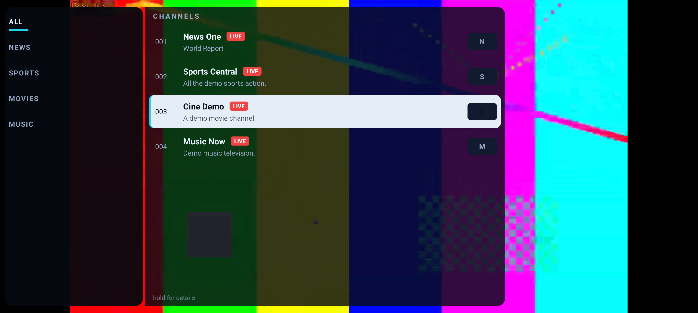
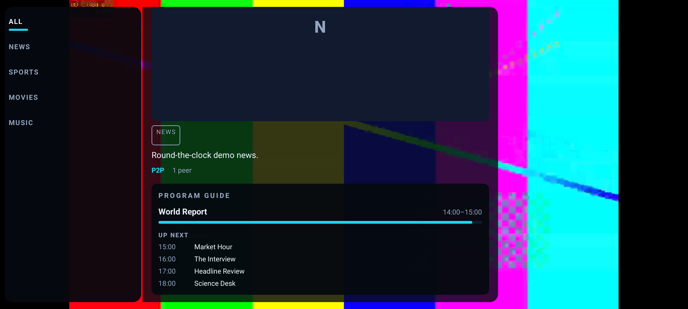
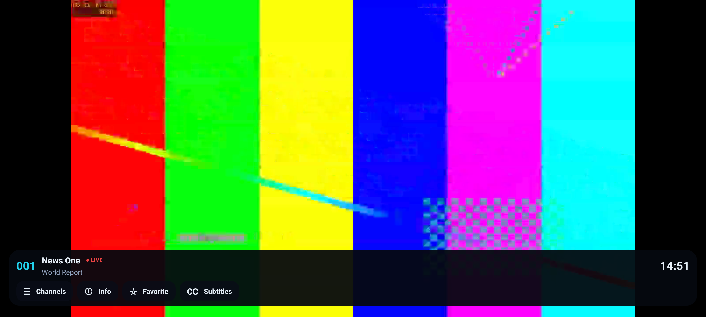
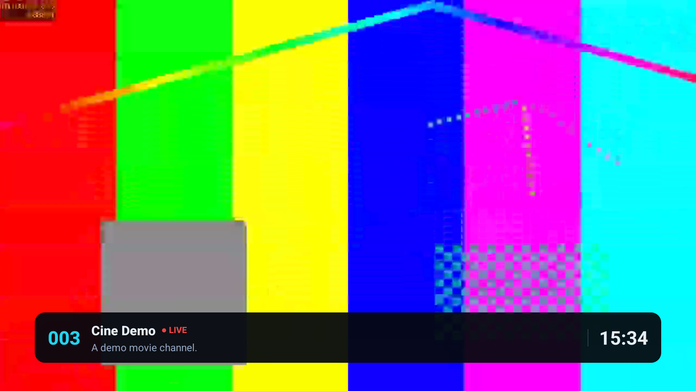
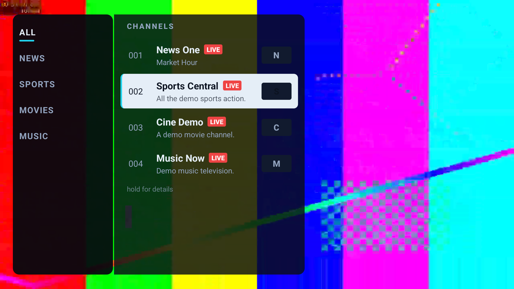
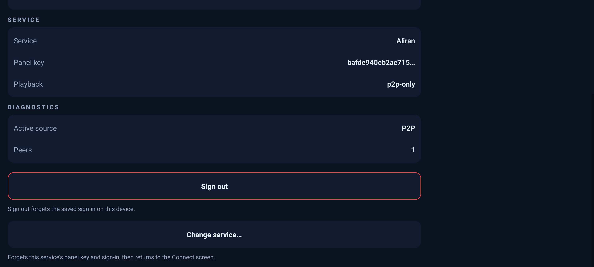

# Android app — viewer guide

This page is for **viewers** using the Aliran app on an Android phone, tablet, or
Android TV — the public build that connects to any Aliran service. If you run the
service itself, you want the [client build page](client-build.md) instead; operators
are welcome to link or copy this guide for their users.

---

## 1. What it is

The Aliran app is a TV app — channel numbers, zapping, favorites, a program
guide — in one APK that works on **both** a phone (touch) and an Android TV
(remote/D-pad). You sign in to a service someone operates (a channel lineup they
curate) and watch fullscreen.

One thing makes it different from an ordinary streaming app, and it's worth
knowing up front: the video travels **peer-to-peer**. While you watch, the app
also shares pieces of the stream you've already received with other viewers of
the same service — that's what lets a small operator serve many viewers without
a big server. It uses upload bandwidth while a channel plays, and it stops when
you close the app. On mobile data it behaves better than most: see
[§8](#8-privacy-bandwidth-honestly).

## 2. Install

Your operator hands you an APK file (usually `aliran-android-public-arm64.apk`
or their own branded name) — or you can download the generic public build
yourself from the project's
[releases page](https://github.com/AbueloSimpson/aliran/releases/latest)
(pick the `arm64` APK for real phones and TVs). It isn't from an app store, so
Android asks you to allow the install:

- **Phone / tablet:** open the APK (from Files, your browser's downloads, or a
  link your operator sent). Android asks to allow installs from that app —
  allow it once ("Install unknown apps"), then **Install**.
- **Android TV:** put the APK on a USB stick and open it with a file manager
  from the Play Store (e.g. "File Commander"), or use a "send files to TV" app —
  same "unknown sources" question, same **Install**. The app then appears in
  the TV launcher's app row like any other channel app.

Playback needs **Android 10 or newer** — that's a hard floor of the P2P
engine, not a preference (older devices, including all Fire OS 7 sticks,
cannot load it). Most TVs and phones from 2020 on are fine. The current
downloads only install on Android 10+; newer operator-distributed builds may
install from Android 7 but show an "engine unavailable" notice on anything
below 10 — either way, older devices cannot play.

**Why the "unknown sources" warning?** Community builds are distributed
directly, not through Play. The warning is Android's standard gate for that.
If you got the file from your operator, proceed; if you got it from somewhere
you don't trust — don't.

## 3. First run: connecting to your service

The app opens on a **Connect** screen asking for three things. All three come
from your operator — there is nothing to figure out yourself:

| Field | What it looks like |
|---|---|
| **Panel public key** | a long code of 64 letters/digits (`0–9`, `a–f`) — paste it exactly (long-press → Paste on phone; type it carefully with the remote on TV) |
| **Username** | your account name on that service |
| **Password** | your account password |

There's no server address or URL to enter, and that's not an oversight: the app
finds your service on a global peer-to-peer network using the key alone. The key
is public (it identifies the service, it doesn't unlock anything), your password
is what signs you in — and it never leaves your device in readable form.

Press **Connect**. The first connection can take a minute or two while the app
finds the network — if it reports the service unreachable on the very first
try, press **Connect** again: the app keeps looking in the background, and the
second attempt usually lands. After that, everything is remembered and every
later launch goes straight to live TV. Still stuck? See
[§9](#9-when-something-doesnt-work).

*(The screenshots in this guide show a small demo service broadcasting colour
bars — your operator's channels appear the same way, with their names, logos
and programs.)*

## 4. Watching TV on a phone

The **menu hub** has Live TV, Favorites, Search and Settings. Open **Live TV**
and you're watching; everything else happens in overlays **while the video
keeps playing**:

| You want to | Do this |
|---|---|
| Open the channel list | tap the screen |
| Browse by category | in the list: the category rail is on the left; categories with `›` have sub-categories |
| Change channel | tap a row in the list — the video switches in place |
| See channel details / the program guide | long-press a row ("hold for details"), or tap **ⓘ** on the bottom bar |
| Add/remove a favorite | the **★** button on the bottom bar (or in the detail panel) |
| Subtitles / audio language | the **CC** button on the bottom bar — shown only when the current channel actually carries tracks |
| Bring back the bottom bar | tap near the bottom of the screen (it fades out over clean video) |
| Go back / close a panel | the Android back gesture/button |

The **bottom bar** shows the channel number, name, what's on now (when the
channel has a guide), the clock — and on on-demand titles it becomes a
play/pause + seek transport.

## 5. Watching TV on an Android TV

Same app, driven with the remote:

| You want to | Do this |
|---|---|
| Change channel | **D-pad up / down** while watching fullscreen — zaps through the whole lineup in channel-number order |
| Open the channel list | **OK / center** while fullscreen |
| Browse by category | in the list: **left** into the category rail, up/down, **OK**; categories with `›` drill into sub-categories |
| See channel details / the program guide | long-press **OK** on a channel row |
| Add/remove a favorite | in the channel detail panel |
| Subtitles / audio language | the **CC** control in the detail panel (only when the channel has tracks) |
| Go back | **Back** — closes the current panel, then exits to the menu |

The list overlay hides itself after a few idle seconds and leaves clean
fullscreen video. Tuning takes a moment — the top-right pill shows progress
while a channel starts; channels near the one you're watching often start
faster, and the optional *Smooth zapping* setting (below) makes surfing
near-instant.

## 6. Settings worth knowing

- **Smooth zapping** — preloads the neighboring channels while you watch so
  zapping feels instant. It costs extra download bandwidth while a channel
  plays, which is why it's off by default; it also pauses itself automatically
  on limited connections or when your stream is struggling.
- **Sign out** — forgets your saved sign-in on this device (use it on a shared
  device). The service stays connected, so the next person just signs in.
- **Change service…** — public builds only: forgets the service's panel key
  *and* the sign-in, and returns to the Connect screen. Use it to switch to a
  different operator. (Builds an operator shipped with their key baked in don't
  show this — there's nothing to change.)
- **Diagnostics** — shows whether the current channel comes peer-to-peer
  (`P2P`, with a peer count) or from a direct internet source (`CDN`).

## 7. Your account and devices

Accounts have a device limit set by the operator (commonly a few devices). Each
phone/TV you sign in on takes a slot; going over the limit signs out the oldest
device. If you're unexpectedly signed out, that's the usual cause — just sign
in again, or ask your operator to raise your limit.

## 8. Privacy & bandwidth, honestly

- **What the app uploads:** encrypted pieces of the streams you watch (or
  recently watched), served to other viewers of the same service. Nothing else.
  It cannot upload anything you didn't download as part of watching.
- **Mobile data is respected:** on cellular or a metered hotspot the app
  **stops re-seeding to other viewers automatically** (your own playback is
  unaffected) and pauses the Smooth-zapping preload. Upload resumes when
  you're back on unmetered Wi-Fi.
- **What others can see:** other viewers' apps see an anonymous peer serving
  stream data — not your name, account, or watch history. Your operator (like
  any streaming provider) knows your account and what it's entitled to.
- **Your password** is processed with a cryptographic protocol (OPRF) that
  never sends it in readable form — not even the operator's server sees it.
- **Saved sign-in** lives inside the app's private storage on the device
  (standard Android app sandboxing — other apps can't read it; anyone you hand
  the unlocked device to can open the app signed-in, like any TV app).

## 9. When something doesn't work

| Problem | What it means / what to do |
|---|---|
| Connect fails after ~1 minute: "Cannot reach the service" | Press **Connect** again first — the app keeps dialing in the background and the retry usually lands. Otherwise: no internet, a network that blocks peer-to-peer traffic (some office/hotel networks), or a mistyped panel key — re-check all 64 characters. |
| "Invalid credentials" | Username or password wrong — they're case-sensitive. Ask your operator to reset if needed. |
| A channel never starts: "the channel may be unreachable right now" | Switch to it again to retry (the app tells you this). If it keeps happening on every channel, your network may be too restrictive for peer-to-peer video. |
| A channel plays audio but no picture, or errors immediately | That channel likely broadcasts in a format this device can't decode (usually HEVC/H.265 on older/cheaper hardware). Other channels keep working; nothing to configure. |
| Picture freezes for a few seconds, then recovers | Normal self-healing after a network hiccup — the app reloads at the live edge, and reconnects deeper if that's not enough. |
| *"…is not broadcasting right now"* | The channel exists but the operator isn't feeding it at the moment. Try later. |
| Channel list is missing channels you expect | Your account isn't entitled to them, or new grants apply at the next sign-in — sign out and back in, or ask your operator. |
| The app opens on Connect again out of nowhere | Someone used *Change service…*, or the app's data was cleared (see below) — reconnect once. |
| Everything is wedged | Android Settings → Apps → Aliran → **Force stop**, then reopen. Still wedged: **Clear storage** is a complete factory reset of the app — you'll need the panel key + sign-in again; the stream cache it deletes is disposable. |

## 10. Uninstall / full reset

Uninstall like any app (long-press the icon, or Settings → Apps). All app data
— the service key, sign-in, favorites, and the stream cache — lives in the
app's private storage and is removed with it. **Clear storage** (without
uninstalling) is the same reset while keeping the app installed.
