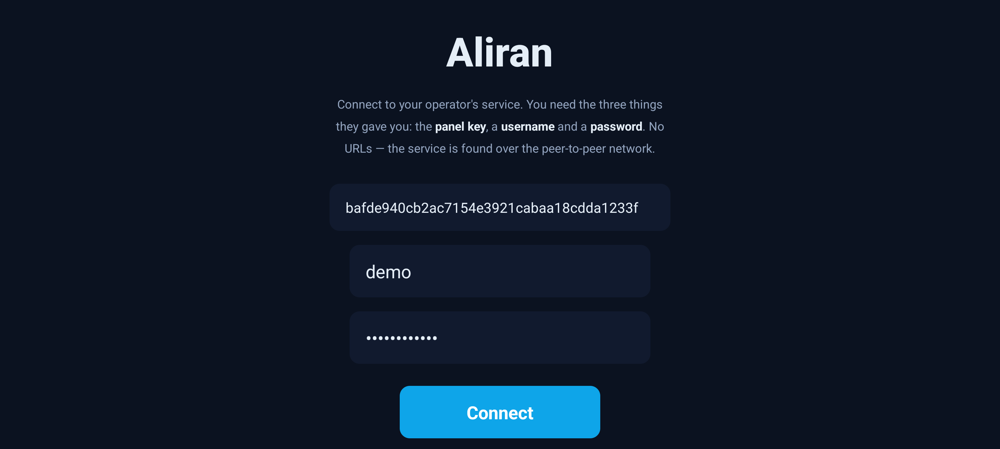
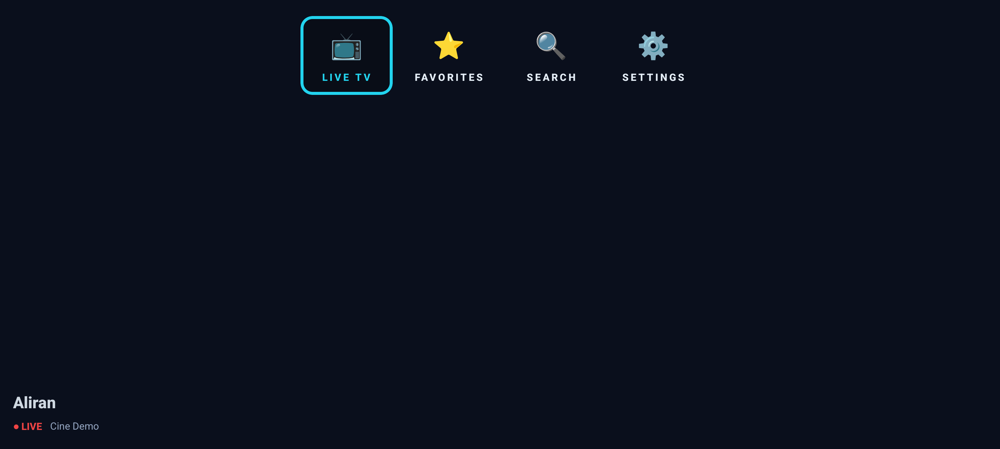
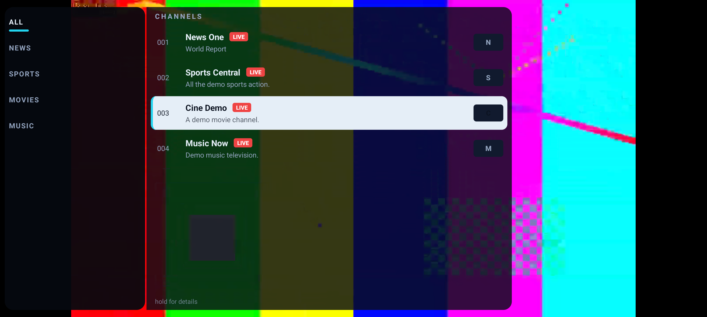
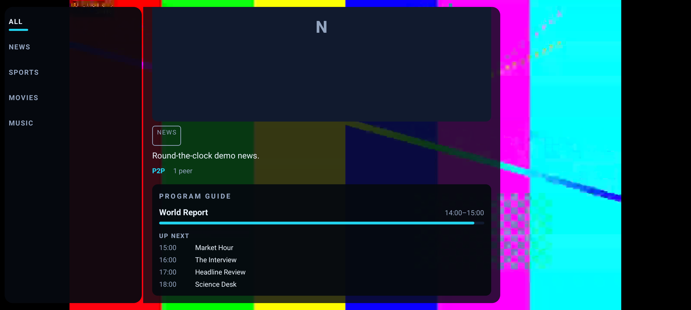
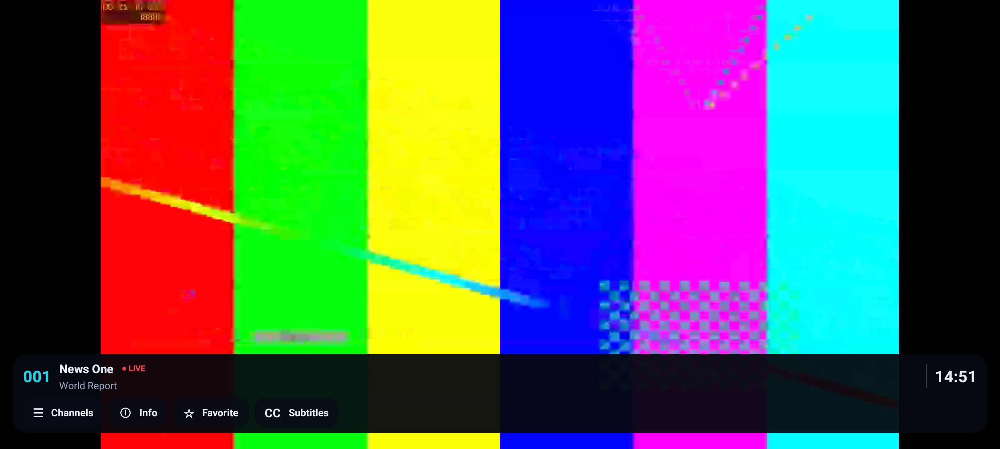
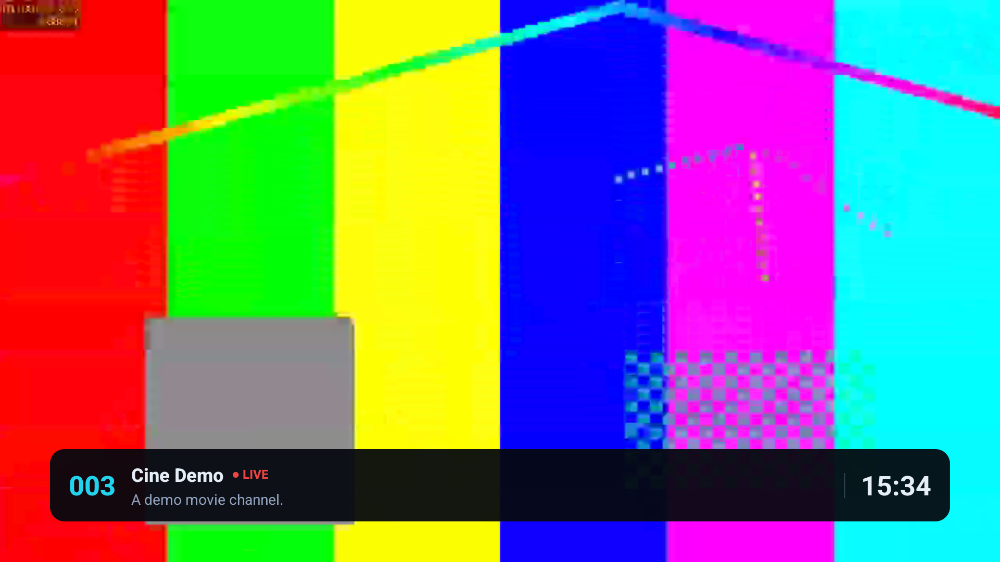
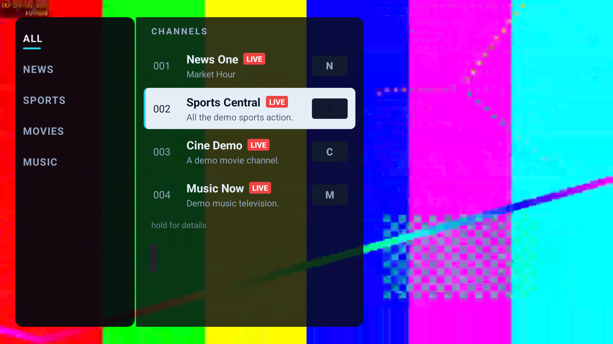
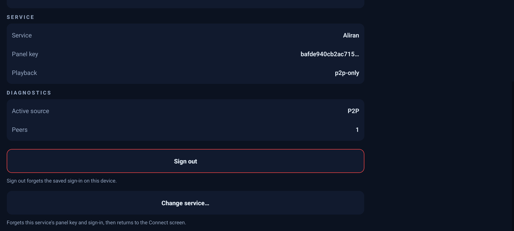

# Android app — viewer guide

This page is for **viewers** using the Aliran app on an Android phone, tablet,
or Android TV — the public build that connects to any Aliran service. If you
run the service itself, use the [client build page](client-build.md) instead.
Operators can link or copy this guide for their viewers.

---

## 1. What it is

The Aliran app is a TV app for your phone, tablet, or Android TV. One APK
works on both: touch on a phone, remote or D-pad on an Android TV. It has
channel numbers, zapping, favorites, and a program guide. You sign in to a
service that someone else operates — a channel lineup they curate — and you
watch it fullscreen.

One thing makes it different from an ordinary streaming app. The video
travels **peer-to-peer**: while you watch, the app also shares pieces of the
stream you've already received with other viewers of the same service. This
is what lets a small operator serve many viewers without a big server. The
app uses upload bandwidth while a channel plays, and it stops when you close
the app. On mobile data it behaves better than most apps like this — see
[§9](#9-privacy-bandwidth-honestly) for the details.

## 2. Install

Your operator hands you an APK file — usually
`aliran-android-public-arm64-v8a.apk`, or their own branded name. Or you can
download the generic public build yourself from the project's
[releases page](https://github.com/AbueloSimpson/aliran/releases/latest).
Pick the `arm64-v8a` APK for real phones and TVs; the smaller `armeabi-v7a`
one is for older 32-bit TV boxes and sticks.

The app isn't from an app store, so Android asks you to allow the install:

- **Phone / tablet:** open the APK — from Files, your browser's downloads, or
  a link your operator sent. Android asks to allow installs from that app.
  Allow it once ("Install unknown apps"), then tap **Install**.
- **Android TV:** put the APK on a USB stick and open it with a file manager
  from the Play Store (for example "File Commander"), or use a "send files to
  TV" app. You'll see the same "unknown sources" question, and the same
  **Install**. The app then appears in the TV launcher's app row like any
  other channel app.

Playback needs **Android 10 or newer**. This is a hard floor of the P2P
engine, not a preference — older devices, including all Fire OS 7 sticks,
cannot load it. Most TVs and phones from 2020 on are fine. The APKs
themselves **install from Android 7**, so one file can go out to a mixed
fleet. But on Android 7–9 the app shows an "engine not supported on this
device" notice instead of playing — installing does not mean it can play.

**Why the "unknown sources" warning?** Community builds are distributed
directly, not through Play. The warning is Android's standard gate for that.
If you got the file from your operator, proceed. If you got it from
somewhere you don't trust, don't.

## 3. First run: connecting to your service

The app opens on a **Connect** screen and asks for three things. All three
come from your operator — you don't need to figure out anything yourself:

| Field | What it looks like |
|---|---|
| **Panel public key** | a long code of 64 letters/digits (`0–9`, `a–f`) — paste it exactly (long-press → Paste on a phone; type it carefully with the remote on a TV) |
| **Username** | your account name on that service |
| **Password** | your account password |

There's no server address or URL to enter. This isn't an oversight — the app
finds your service on a global peer-to-peer network using the key alone. The
key is public: it identifies the service, but it doesn't unlock anything.
Your password is what signs you in, and it never leaves your device in
readable form.

Press **Connect**. The first connection can take a minute or two while the
app finds the network. If it reports the service unreachable on the very
first try, press **Connect** again — the app keeps looking in the background,
and the second attempt usually lands. After that, the app remembers
everything, and every later launch goes straight to live TV. Still stuck? See
[§10](#10-when-something-doesnt-work).

*(The screenshots in this guide show a small demo service broadcasting colour
bars — your operator's channels appear the same way, with their own names,
logos, and programs.)*

## 4. Watching TV on a phone

The **menu hub** has Live TV, Favorites, Search, and Settings. Open **Live
TV** and you're watching. Everything else happens in overlays, while the
video keeps playing:

| You want to | Do this |
|---|---|
| Open the channel list | tap the screen |
| Browse by category | in the list: the category rail is on the left; categories with `›` have sub-categories |
| Change channel | tap a row in the list — the video switches in place |
| See channel details / the program guide | long-press a row ("hold for details"), or tap **ⓘ** on the bottom bar |
| Add/remove a favorite | the **★** button on the bottom bar (or in the detail panel) |
| Subtitles / audio language | the **CC** button on the bottom bar — shown only when the current channel actually carries tracks |
| Bring back the bottom bar | tap near the bottom of the screen (it fades out over clean video) |
| Go back / close a panel | the Android back gesture/button |

The **bottom bar** shows the channel number, name, what's on now (when the
channel has a guide), and the clock. On on-demand titles it becomes a
play/pause and seek transport instead.

## 5. Watching TV on an Android TV

Same app, driven with the remote:

| You want to | Do this |
|---|---|
| Change channel | **D-pad up / down** while watching fullscreen — zaps through the whole lineup in channel-number order |
| Open the channel list | **OK / center** while fullscreen |
| Browse by category | in the list: **left** into the category rail, up/down, **OK**; categories with `›` drill into sub-categories |
| See channel details / the program guide | long-press **OK** on a channel row |
| Add/remove a favorite | in the channel detail panel |
| Subtitles / audio language | the **CC** control in the detail panel (only when the channel has tracks) |
| Go back | **Back** — closes the current panel, then exits to the menu |

The list overlay hides itself after a few idle seconds, leaving clean
fullscreen video. Tuning takes a moment: the top-right pill shows progress
while a channel starts. Channels near the one you're watching often start
faster, and the optional *Smooth zapping* setting (below) makes surfing
near-instant.

## 6. Movies & Series (if your service has them)

Some services add a **Movies & Series** tile to the menu — an on-demand
catalog next to the live channels. Inside it:

- The left menu switches between **Movies**, **Series**, and **Search**.
  Search is its own screen, with a result grid.
- The tab bar on top — **Recommended · My List · Genres · All** — works the
  same for movies and series. *Recommended* shows "Recently added" and
  "Newest releases" rows. *Genres* shows one card per genre. *All* is the
  full grid.
- The **"Sort by" chip** above the grid opens the sort menu: Recently added,
  A-Z, Newest releases, Oldest releases, Recently watched. On the A-Z sort, a
  **letter rail** appears on the right edge. Tap it, or D-pad into it, to
  jump to a letter.
- **My List:** long-press a poster (hold **OK** on a TV remote) to add or
  remove a title. You can also add a series from its detail page.
- **Series** open a detail page: pick a season, pick an episode, and it
  plays. **Start** plays the next episode from where you left off.
- Titles **resume** from where you stopped watching. The *Recently watched*
  sort surfaces whatever you were in the middle of.
- On the phone, the **⋮** button in the player picks subtitle and audio
  languages when the title carries them.

Your list and your watch history are stored **only on this device**. The app
never sends them to your operator or anyone else, and clearing the app's
data erases them.

## 7. Settings worth knowing

- **Smooth zapping** — preloads the neighboring channels while you watch, so
  zapping feels instant. It costs extra download bandwidth while a channel
  plays, which is why it's off by default. It also pauses itself
  automatically on limited connections, or when your stream is struggling.
- **Sign out** — forgets your saved sign-in on this device. Use it on a
  shared device. The service stays connected, so the next person just signs
  in.
- **Change service…** — public builds only. Forgets the service's panel key
  and your sign-in, and returns to the Connect screen. Use it to switch to a
  different operator. Builds an operator shipped with their key baked in
  don't show this option — there's nothing to change.
- **Diagnostics** — shows whether the current channel comes peer-to-peer
  (`P2P`, with a peer count) or from a direct internet source (`CDN`).

## 8. Your account and devices

Your operator sets a device limit for your account — commonly a few devices.
Each phone or TV you sign in on takes one slot. Going over the limit signs
out the oldest device. If you're unexpectedly signed out, this is the usual
cause. Sign in again, or ask your operator to raise your limit.

## 9. Privacy & bandwidth, honestly

- **What the app uploads:** encrypted pieces of the streams you watch, or
  recently watched, served to other viewers of the same service. Nothing
  else. The app cannot upload anything you didn't already download as part
  of watching.
- **Mobile data is respected:** on cellular or a metered hotspot, the app
  **stops re-seeding to other viewers automatically** — your own playback is
  unaffected — and pauses the Smooth-zapping preload. Upload resumes once
  you're back on unmetered Wi-Fi.
- **What others can see:** other viewers' apps see an anonymous peer serving
  stream data — not your name, account, or watch history. Your operator,
  like any streaming provider, knows your account and what it can access.
- **Your password** is processed with a cryptographic protocol (OPRF) that
  never sends it in readable form. Not even the operator's server sees it.
- **Your saved sign-in** lives inside the app's private storage on the
  device. This is standard Android app sandboxing — other apps can't read
  it. Anyone you hand the unlocked device to can open the app already
  signed in, like any TV app.

## 10. When something doesn't work

| Problem | What it means / what to do |
|---|---|
| Connect fails after ~1 minute: "Cannot reach the service" | Press **Connect** again first — the app keeps dialing in the background, and the retry usually lands. Otherwise, check for: no internet, a network that blocks peer-to-peer traffic (some office/hotel networks), or a mistyped panel key — recheck all 64 characters. |
| "Invalid credentials" | Your username or password is wrong — both are case-sensitive. Ask your operator to reset it if needed. |
| A channel never starts: "the channel may be unreachable right now" | Switch to it again to retry (the app tells you this). If it keeps happening on every channel, your network may be too restrictive for peer-to-peer video. |
| A channel plays audio but no picture, or errors immediately | That channel likely broadcasts in a format this device can't decode — usually HEVC/H.265 on older or cheaper hardware. Other channels keep working; there's nothing to configure. |
| Picture freezes for a few seconds, then recovers | This is normal self-healing after a network hiccup. The app reloads at the live edge, and reconnects deeper if that's not enough. |
| *"…is not broadcasting right now"* | The channel exists, but the operator isn't feeding it at the moment. Try later. |
| Channel list is missing channels you expect | Your account isn't granted access to them, or a new grant applies at the next sign-in. Sign out and back in, or ask your operator. |
| The app opens on Connect again out of nowhere | Someone used *Change service…*, or the app's data was cleared (see below). Reconnect once. |
| Everything is wedged | Go to Android Settings → Apps → Aliran → **Force stop**, then reopen. Still wedged: **Clear storage** is a complete factory reset of the app — you'll need the panel key and sign-in again. The stream cache it deletes is disposable. |

## 11. Uninstall / full reset

Uninstall it like any app: long-press the icon, or use Settings → Apps. All
app data — the service key, sign-in, favorites, and the stream cache — lives
in the app's private storage and is removed with it. **Clear storage**,
without uninstalling, gives you the same reset while keeping the app
installed.
