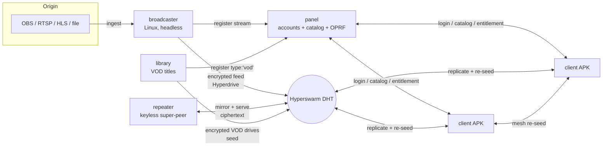
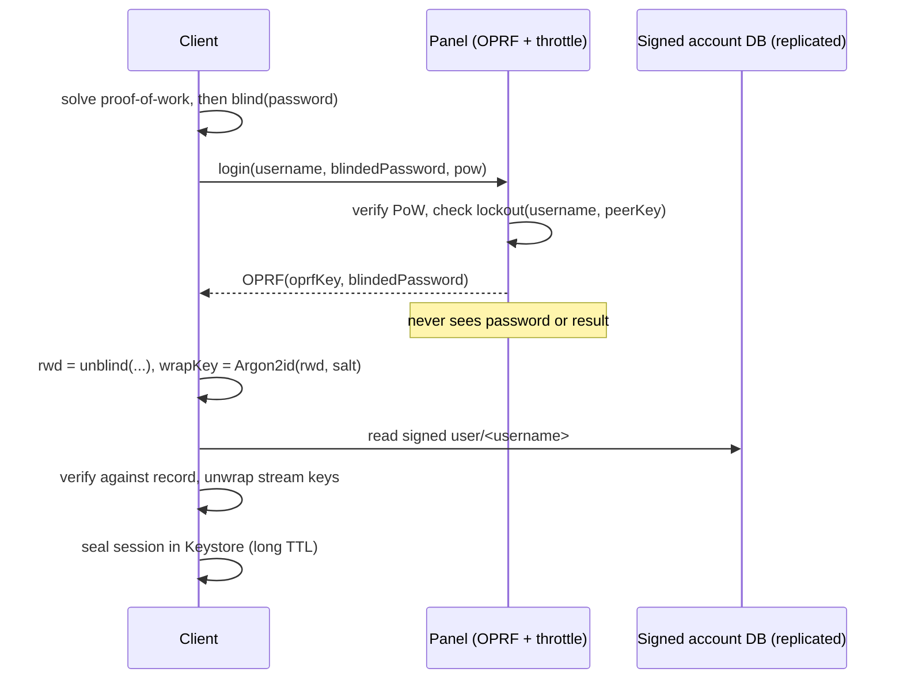
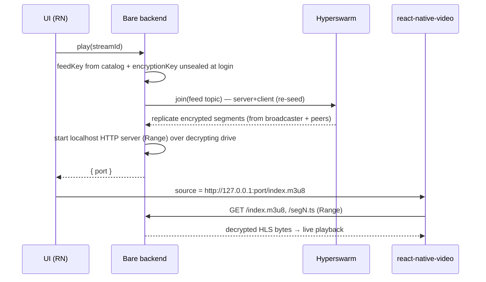

# Architecture

Aliran has **five peer-to-peer components**. Transport, discovery, and replication
are fully serverless (Hyperswarm DHT — the mechanics are in
[How peers find each other](concepts.md#how-peers-find-each-other)); the panel is
the *logical* authority for accounts + catalog, and is the only online dependency
(for new logins only).

## Components

### Broadcaster (Linux)
Ingests an existing stream (OBS RTMP push, or pull from RTSP/HLS/file), transcodes to
**live HLS**, writes the encrypted segments into a
**Hyperdrive**, and seeds it over Hyperswarm. Registers the stream + metadata with the
panel. Playback "live" is handled by HLS semantics; the P2P layer just moves bytes.

### Client (Android phone + TV)
A React Native (`react-native-tvos`) app embedding **Bare** via `react-native-bare-kit`.
Inside Bare: Hyperswarm + Hyperdrive replica + a **localhost HTTP server** with Range
support. `react-native-video` plays `http://127.0.0.1:<port>/index.m3u8`. The client
**both downloads and re-seeds** — distribution scales with viewers. (The same
engine also ships as **`aliran-kit`**, a native Kotlin SDK for non-RN Android
apps — one APK from Android 5.0, engine active on 10+; see the
[SDK guide](sdk-guide.md#native-android-kotlin-aliran-kit-one-apk-from-android-50).)

### Panel (Linux/desktop)
A single-writer, **panel-signed** Hyperbee holding the **account DB** and **stream
catalog**, plus an **assets Hyperdrive** (posters/art). Serves an **OPRF login** RPC
(brute-force choke point) and issues session/entitlement tokens. Today a deployment
runs one panel node — viewers only need it online for *new* logins; an HA replica
set (threshold OPRF) is on the roadmap.

### Repeater (Linux, optional)
A **keyless** regional super-peer ([repeater.md](repeater.md)) — the Open-Connect
analog. Configured with only the panel's *public* key and a channel selection, it
mirrors chosen channels' live windows **raw at the block level** (the catalog's
`feedKey` + panel-published `blobsKey`) and serves that **ciphertext** to viewers,
absorbing fan-out so the origin broadcaster's per-channel egress drops to roughly
one stream per repeater. It holds no grants and cannot watch what it serves.

### Library (Linux, optional — VOD)
The standalone **VOD service** ([VOD library](vod-library.md)):
operator-registered video **files** become encrypted, P2P-seeded on-demand titles
(`type:'vod'` + `durationSec` in the catalog, granted exactly like channels).
Deliberately separate from the broadcaster: ingest is a one-shot transcode burst
and then a **static seed** — none of the live pipeline's lifecycle applies, and it
runs on whatever box has the disk and spare CPU. One Corestore + one Hyperswarm
carry every title; a title keeps **all** its segments (seek = HTTP Range over
demand-paged P2P blocks), so disk = title size, reclaimed only by delete.

## Key data flows

- **Login:** client → panel OPRF RPC (blinded password, PoW) → derives key → verifies
  against the signed DB → unwraps stream keys. See
  [security-model.md](security-model.md).
- **Catalog:** panel appends signed metadata; clients `bee.watch()` for live updates.
- **Stream join:** client takes `feedKey` from the catalog and the `encryptionKey` it
  unsealed at login (not from the catalog) → joins the feed swarm
  → replicates (decrypting) → serves locally → plays.
- **Redirect channels:** a catalog entry can instead carry `{redirect: true, url}` —
  the client plays the operator's https HLS URL **directly** (no feed, no swarm
  join). See [content-management.md](content-management.md).

## Sequence diagrams

### Login (OPRF — brute-force resistant)

### Stream join & playback

