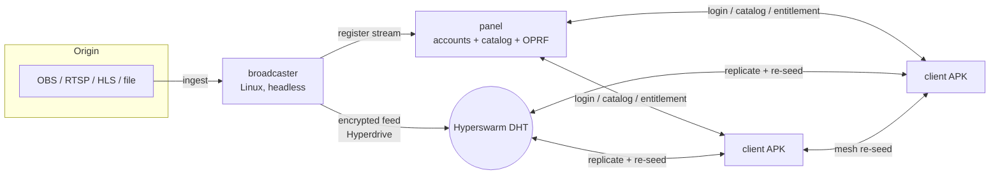

# Architecture

Aliran has **three peer-to-peer components**. Transport, discovery, and replication
are fully serverless (Hyperswarm DHT); the panel is the *logical* authority for
accounts + catalog, and is the only online dependency (for new logins only).

## Components

### Broadcaster (Linux)
Ingests an existing stream (OBS RTMP push, or pull from RTSP/HLS/file), transcodes to
**live HLS** (or CENC/CMAF for DRM), writes the encrypted segments into a
**Hyperdrive**, and seeds it over Hyperswarm. Registers the stream + metadata with the
panel. Playback "live" is handled by HLS semantics; the P2P layer just moves bytes.

### Client (Android phone + TV)
A React Native (`react-native-tvos`) app embedding **Bare** via `react-native-bare-kit`.
Inside Bare: Hyperswarm + Hyperdrive replica + a **localhost HTTP server** with Range
support. `react-native-video` plays `http://127.0.0.1:<port>/index.m3u8`. The client
**both downloads and re-seeds** — distribution scales with viewers.

### Panel (Linux/desktop, HA)
A single-writer, **panel-signed** Hyperbee holding the **account DB** and **stream
catalog**, plus an **assets Hyperdrive** (posters/art). Serves an **OPRF login** RPC
(brute-force choke point) and issues session/entitlement tokens. Runs as a replica set
(threshold OPRF) for availability.

## Key data flows

- **Login:** client → panel OPRF RPC (blinded password, PoW) → derives key → verifies
  against the signed DB → unwraps stream keys. See
  [security-model.md](security-model.md).
- **Catalog:** panel appends signed metadata; clients `bee.watch()` for live updates.
- **Stream join:** client resolves `{ feedKey, encryptionKey }` → joins the feed swarm
  → replicates (decrypting) → serves locally → plays.
- **DRM (optional):** encrypted CENC bytes flow P2P; the license request goes to the
  DRM vendor with a panel-issued entitlement JWT.

## Sequence diagrams

> TODO: add Mermaid `sequenceDiagram` blocks for login/OPRF, stream join, and DRM
> license acquisition.
