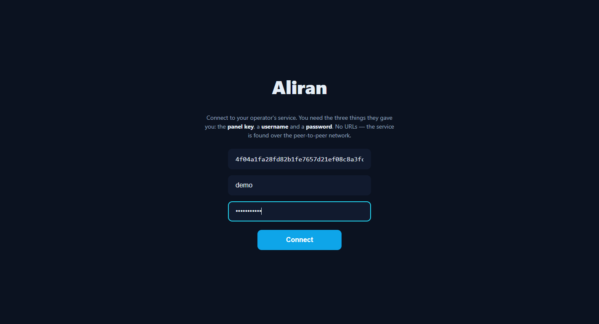
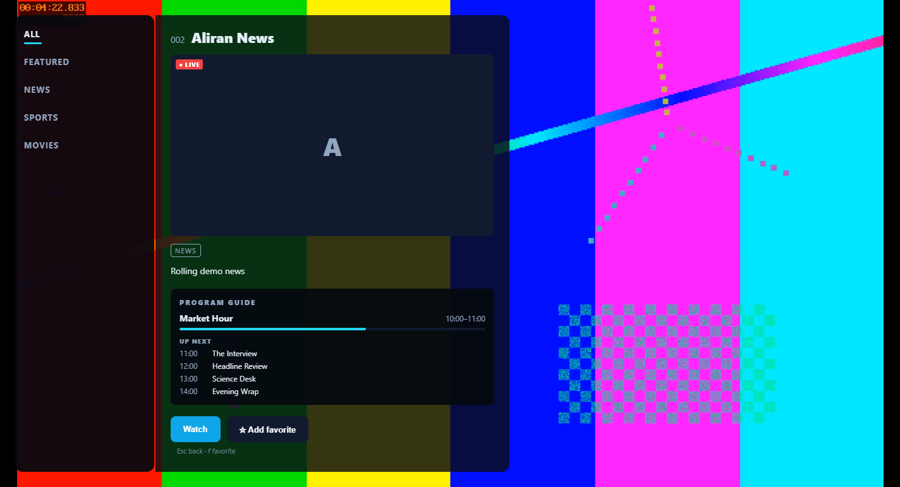

# Desktop player — viewer guide

This page is for **viewers** using the Aliran desktop player on Windows — the
public build that connects to any Aliran service. If you run the service itself,
you want the [operator/developer page](desktop-player.md) instead; operators are
welcome to link or copy this guide for their users.

---

## 1. What it is

The desktop player is a TV app for your PC. You sign in to a service someone
operates (a channel lineup they curate), and you watch it fullscreen with a
remote-control-style interface — channel numbers, zapping, favorites, a program
guide.

One thing makes it different from an ordinary streaming app, and it's worth
knowing up front: the video travels **peer-to-peer**. While you watch, the app
also shares pieces of the stream you've already received with other viewers of
the same service — that's what lets a small operator serve many viewers without
a big server. It uses upload bandwidth while a channel plays (roughly comparable
to the channel's own bitrate at most), and stops when you close the app. See
[§7](#7-privacy--bandwidth-honestly) for exactly what is and isn't shared.

## 2. Install

Your operator gives you one of two files:

- **`Aliran Setup <version>.exe`** — a normal installer: run it, and the app
  lands in your Start menu. It installs per-user, so no administrator prompt.
- **`Aliran-<version>-portable.exe`** — no install at all: put the file
  anywhere (Desktop, USB stick) and double-click it.

Both behave identically once running.

**About the Windows warning:** the first launch usually shows a blue
SmartScreen dialog — *"Windows protected your PC"*, publisher unknown. That's
because community builds aren't code-signed (signing certificates are paid,
per-publisher). If you got the file from your operator, click **More info →
Run anyway**. If you got it from somewhere you don't trust — don't.

## 3. First run: connecting to your service

The app opens on a **Connect** screen asking for three things. All three come
from your operator — there is nothing to figure out yourself:

| Field | What it looks like |
|---|---|
| **Panel public key** | a long code of 64 letters/digits (`0–9`, `a–f`), e.g. `e79c2…` — paste it exactly |
| **Username** | your account name on that service |
| **Password** | your account password |

There's no server address or URL to enter, and that's not an oversight: the app
finds your service on a global peer-to-peer network using the key alone. The key
is public (it identifies the service, it doesn't unlock anything), your password
is what signs you in — and it never leaves your computer in readable form.

Press **Connect**. The first connection can take up to a minute while the app
finds the network; after that, the app remembers everything and every later
launch goes straight to live TV. If it fails, see
[§8](#8-when-something-doesnt-work).

*(The screenshots in this guide show a small demo service broadcasting colour
bars — your operator's channels appear the same way, with their names, logos and
programs.)*

## 4. Watching TV

Everything works with the keyboard (like a remote) and the mouse equally.

| You want to | Do this |
|---|---|
| Change channel | `↑` / `↓` — zaps through the whole lineup in channel-number order |
| Open the channel list | `Enter` or click the screen |
| Browse by category | in the list: `←` into the category rail, `↑`/`↓`, `Enter`; categories with `›` have sub-categories |
| See what's on / channel details | `i` (or right-click a channel row) — shows the program guide when the channel has one |
| Add/remove a favorite | `f` (or the ★ button on the bottom bar) |
| Subtitles / audio language | `c` (or the `CC` button) — shown only when the current channel actually carries tracks |
| Go back / close a panel | `Esc` |
| Main menu (Favorites, Search, Settings) | `Esc` from fullscreen video |

Things that are normal:

- **Browsing never stops playback** — panels overlay the video, and the list
  hides itself after a few idle seconds.
- **Tuning takes a moment** — the top-right pill shows progress while a channel
  starts. Channels near the one you're watching often start faster, and the
  optional *Smooth zapping* setting (below) makes surfing near-instant.
- The bottom bar and mouse cursor fade out over clean video; move the mouse or
  press any key to bring them back.
- If your service has **on-demand titles** (movies/shows, not live), they play
  with a seek bar and pause — `Space` pauses, drag the bar to seek.

## 5. Settings worth knowing

- **Smooth zapping** — preloads the neighboring channels while you watch so
  `↑`/`↓` feels instant. It costs extra download bandwidth while a channel
  plays, which is why it's off by default; it also pauses itself automatically
  if your connection is struggling or marked as limited.
- **Sign out** — forgets your saved sign-in on this PC (use it on a shared
  computer). The service key stays, so the next person just signs in.
- **Change service…** — forgets the service key *and* the sign-in, and restarts
  the app back to the Connect screen. Use it to switch to a different operator.
- **Diagnostics** — shows whether the current channel comes peer-to-peer
  (`P2P`, with a peer count) or from a direct internet source (`CDN`).

## 6. Your account and devices

Accounts have a device limit set by the operator (commonly a few devices). Each
PC/phone you sign in on takes a slot; going over the limit signs out the oldest
device. If you're unexpectedly signed out, that's the usual cause — just sign
in again, or ask your operator to raise your limit.

## 7. Privacy & bandwidth, honestly

- **What the app uploads:** encrypted pieces of the streams you watch (or
  recently watched), served to other viewers of the same service. Nothing else.
  It cannot upload anything you didn't download as part of watching.
- **What others can see:** other viewers' apps see an anonymous peer serving
  stream data — not your name, account, or watch history. Your operator (like
  any streaming provider) knows your account and what it's entitled to.
- **Your password** is processed with a cryptographic protocol (OPRF) that
  never sends it in readable form — not even the operator's server sees it.
- **Saved sign-in** is encrypted with Windows' own user-account protection
  (DPAPI); the service key is stored as a plain setting (it's public anyway).
- **Metered connections:** Windows doesn't tell apps reliably when a connection
  is metered, so if you're on a hotspot or capped plan, the practical advice is
  simply to close the app when you're not watching — uploading only happens
  while it runs.

## 8. When something doesn't work

| Problem | What it means / what to do |
|---|---|
| Connect fails after ~1 minute: "Cannot reach the service" | Either no internet, a network that blocks peer-to-peer traffic (some office/hotel networks), or a mistyped panel key — re-paste it carefully (all 64 characters). |
| "Invalid credentials" | Username or password wrong — they're case-sensitive. Ask your operator to reset if needed. |
| A channel shows *"can't decode this channel's video format"* | That channel broadcasts in a format your PC's graphics hardware can't decode (usually HEVC/H.265 on older PCs). Other channels keep working; there's nothing to configure. |
| Picture freezes for a few seconds, then recovers | Normal self-healing after a network hiccup — the app reloads at the live edge, and reconnects deeper if that's not enough. |
| *"…is not broadcasting right now"* | The channel exists but the operator isn't feeding it at the moment. Try later. |
| Channel list is missing channels you expect | Your account isn't entitled to them, or new grants apply at the next sign-in — sign out and back in, or ask your operator. |
| The app opens on Connect again out of nowhere | Someone used *Change service…*, or your Windows user profile was reset (that also invalidates the encrypted sign-in — reconnect once). |
| Two copies won't run at once | By design — the second launch focuses the first window. |

## 9. Uninstall / full reset

- Installer build: uninstall from Windows *Apps* as usual. Portable build:
  delete the exe.
- App data (service key, sign-in, favorites, and the stream cache) lives in
  `%APPDATA%\aliran-desktop`. Deleting that folder while the app is closed is a
  complete factory reset — the stream cache inside it is disposable and safe to
  delete anytime.
