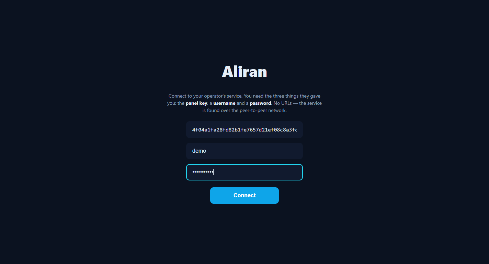
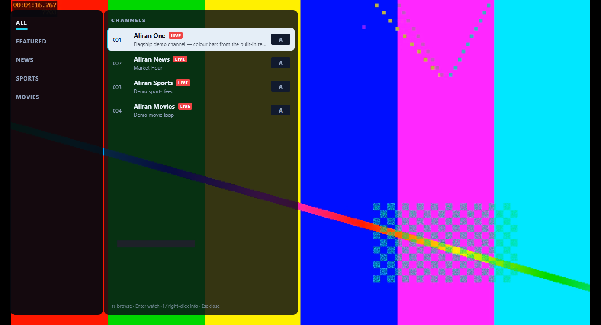
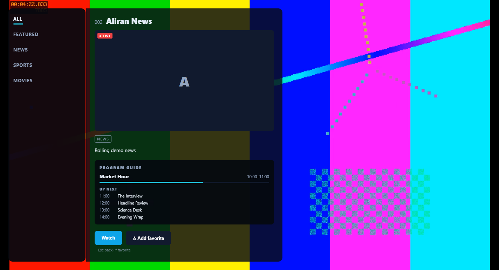

# Desktop player — viewer guide

This page is for **viewers** using the Aliran desktop player on Windows or
macOS — the public build that connects to any Aliran service. If you run the
service itself, use the [operator/developer page](desktop-player.md) instead.
Operators can link or copy this guide for their viewers.

---

## 1. What it is

The desktop player is a TV app for your computer. You sign in to a service
that someone else operates — a channel lineup they curate — and you watch it
fullscreen with a remote-control-style interface: channel numbers, zapping,
favorites, a program guide.

One thing makes it different from an ordinary streaming app. The video
travels **peer-to-peer**: while you watch, the app also shares pieces of the
stream you've already received with other viewers of the same service. This
is what lets a small operator serve many viewers without a big server. The
app uses upload bandwidth while a channel plays — roughly comparable to the
channel's own bitrate at most — and stops uploading when you close the app.
See [§8](#8-privacy-bandwidth-honestly) for exactly what the app shares and
what it doesn't.

## 2. Install

Your operator gives you the right file for your computer. Or, download the
generic public build yourself from the project's
[releases page](https://github.com/AbueloSimpson/aliran/releases/latest).

**Windows** needs Windows 10 or newer, 64-bit. Either file works, and both
behave identically once running:

- **`Aliran Setup <version>.exe`** — a normal installer. Run it, and the app
  lands in your Start menu. It installs per-user, so it needs no
  administrator prompt.
- **`Aliran-<version>-portable.exe`** — no install step. Put the file
  anywhere (Desktop, USB stick) and double-click it.

!!! warning "Windows may show a blue SmartScreen warning on first launch"
    The dialog says *"Windows protected your PC"* and lists the publisher as
    unknown. This happens because community builds aren't code-signed —
    signing certificates cost money, per publisher. If you got the file from
    your operator, click **More info → Run anyway**. If you got the file from
    somewhere you don't trust, don't run it.

**macOS** needs macOS 13 Ventura or newer. Pick the file that matches your
Mac's chip (Apple menu → *About This Mac*): **`…-arm64…`** for Apple silicon
(M-series), **`…-intel…`** for an Intel Mac. The `.dmg` is the normal route —
open it and drag **Aliran** into *Applications*. The `.zip` contains the same
app, already unpacked; double-click to run it.

!!! warning "macOS may block the app as unverified on first launch"
    These builds aren't notarized with Apple — the same paid-certificate
    reality as Windows — so the first launch shows *"Aliran" cannot be
    opened*. On macOS 15 or newer: close that dialog, open **System Settings
    → Privacy & Security**, scroll to the "Aliran was blocked" notice, and
    click **Open Anyway** (once per machine). On older macOS: right-click the
    app, choose **Open**, then confirm **Open**. Same trust rule as Windows —
    only do this if the file came from your operator or the project's
    releases page.

## 3. First run: connecting to your service

The app opens on a **Connect** screen and asks for three things. All three
come from your operator — you don't need to figure out anything yourself:

| Field | What it looks like |
|---|---|
| **Panel public key** | a long code of 64 letters/digits (`0–9`, `a–f`), e.g. `e79c2…` — paste it exactly |
| **Username** | your account name on that service |
| **Password** | your account password |

There's no server address or URL to enter. This isn't an oversight — the app
finds your service on a global peer-to-peer network using the key alone. The
key is public: it identifies the service, but it doesn't unlock anything. Your
password is what signs you in, and it never leaves your computer in readable
form.

Press **Connect**. The first connection can take up to a minute while the app
finds the network. After that, the app remembers everything, and every later
launch goes straight to live TV. If the connection fails, see
[§9](#9-when-something-doesnt-work).

*(The screenshots in this guide show a small demo service broadcasting colour
bars. Your operator's channels appear the same way, with their own names,
logos, and programs.)*

## 4. Watching TV

The keyboard (like a remote) and the mouse both work everywhere in the app.

| You want to | Do this |
|---|---|
| Change channel | `↑` / `↓` — zaps through the whole lineup in channel-number order |
| Open the channel list | `Enter` or click the screen |
| Browse by category | in the list: `←` into the category rail, `↑`/`↓`, `Enter`; categories with `›` have sub-categories |
| See what's on / channel details | `i` (or right-click a channel row) — shows the program guide when the channel has one |
| Add/remove a favorite | `f` (or the ★ button on the bottom bar) |
| Subtitles / audio language | `c` (or the `CC` button) — shown only when the current channel actually carries tracks |
| Go back / close a panel | `Esc` |
| Main menu (Favorites, Search, Settings) | `Esc` from fullscreen video |

A few things are normal, not bugs:

- **Browsing never stops playback.** Panels overlay the video, and the list
  hides itself after a few idle seconds.
- **Tuning takes a moment.** The top-right pill shows progress while a
  channel starts. Channels near the one you're watching often start faster.
  The optional *Smooth zapping* setting (below) makes surfing near-instant.
- The bottom bar and mouse cursor fade out over clean video. Move the mouse
  or press any key to bring them back.
- If your service has **on-demand titles** (movies or shows, not live), they
  play with a seek bar and a pause control. `Space` pauses; drag the bar to
  seek.

## 5. Movies & Series (if your service has them)

Some services add a **Movies & Series** tile to the main menu — an
on-demand catalog next to the live channels. Inside it:

- The left menu switches between **Movies**, **Series**, and **Search**
  (search is its own view, with a result grid). The content pane has a tab
  bar — **Recommended · My List · Genres · All** — plus a **"Sort by" chip**
  that opens the sort menu (Recently added, A-Z, Newest releases, Oldest
  releases, Recently watched).
- On the A-Z sort, a **letter rail** appears on the right edge. Click a
  letter to jump there. The letter of what you're currently looking at stays
  highlighted as you scroll.
- **My List:** hover a poster and click the **＋** that appears, or
  right-click the tile. You can also add a series from its detail page.
- **Series** open a detail page: pick a season, pick an episode, and it
  plays. **Start** plays the next episode from where you left off.
- Titles **resume** from where you stopped watching. The *Recently watched*
  sort surfaces whatever you're in the middle of.
- In the player: `Space` pauses, `←`/`→` seek. `c` (or the **⋮** button)
  picks a subtitle or audio language when the title carries one. `Esc` goes
  back.

Your list and your watch history are stored **only on this computer**. The
app never sends them to your operator or to anyone else.

## 6. Settings worth knowing

- **Smooth zapping** — preloads neighboring channels while you watch, so
  `↑`/`↓` feels instant. It costs extra download bandwidth while a channel
  plays, which is why it's off by default. It also pauses itself
  automatically if your connection is struggling or marked as limited.
- **Sign out** — forgets your saved sign-in on this computer (use it on a
  shared computer). The service key stays, so the next person only needs to
  sign in.
- **Change service…** — forgets both the service key and the sign-in, and
  restarts the app back to the Connect screen. Use it to switch to a
  different operator.
- **Diagnostics** — shows whether the current channel comes peer-to-peer
  (`P2P`, with a peer count) or from a direct internet source (`CDN`).

## 7. Your account and devices

Your operator sets a device limit for your account (commonly a few devices).
Each computer or phone you sign in on takes one slot. Going over the limit
signs out the oldest device. If you're unexpectedly signed out, this is the
usual cause — sign in again, or ask your operator to raise your limit.

## 8. Privacy & bandwidth, honestly

- **What the app uploads:** encrypted pieces of the streams you watch, or
  recently watched, served to other viewers of the same service. Nothing
  else. The app cannot upload anything you didn't already download as part
  of watching.
- **What others can see:** other viewers' apps see an anonymous peer serving
  stream data — not your name, account, or watch history. Your operator, like
  any streaming provider, knows your account and what it's entitled to.
- **Your password** is processed with a cryptographic protocol (OPRF) that
  never sends it in readable form. Not even the operator's server sees it.
- **Your saved sign-in** is encrypted with Windows' own user-account
  protection (DPAPI). The service key itself is stored as a plain setting,
  since it's public anyway.
- **Metered connections:** Windows doesn't reliably tell apps when a
  connection is metered. If you're on a hotspot or a capped plan, the
  practical advice is to close the app when you're not watching — the app
  only uploads while it runs.

## 9. When something doesn't work

| Problem | What it means / what to do |
|---|---|
| Connect fails after ~1 minute: "Cannot reach the service" | Either you have no internet, your network blocks peer-to-peer traffic (some office/hotel networks do), or you mistyped the panel key. Re-paste it carefully — all 64 characters. |
| "Invalid credentials" | Your username or password is wrong. Both are case-sensitive. Ask your operator to reset it if needed. |
| A channel shows *"can't decode this channel's video format"* | That channel broadcasts in a format your computer's graphics hardware can't decode — usually HEVC/H.265 on older computers. Other channels keep working; there's nothing to configure. |
| Picture freezes for a few seconds, then recovers | This is normal self-healing after a network hiccup. The app reloads at the live edge, and reconnects deeper if that's not enough. |
| *"…is not broadcasting right now"* | The channel exists, but the operator isn't feeding it at the moment. Try again later. |
| Channel list is missing channels you expect | Your account isn't entitled to them, or a new grant hasn't applied yet. Sign out and back in, or ask your operator. |
| The app opens on Connect again out of nowhere | Someone used *Change service…*, or your Windows user profile was reset (this also invalidates the encrypted sign-in — reconnect once). |
| Two copies won't run at once | This is by design. The second launch focuses the first window instead. |

## 10. Uninstall / full reset

Installer build: uninstall from Windows *Apps* as usual. Portable build:
delete the exe.

App data — the service key, sign-in, favorites, and stream cache — lives in
`%APPDATA%\aliran-desktop`. Close the app, then delete that folder for a
complete factory reset. The stream cache inside it is disposable; you can
delete it safely at any time.
