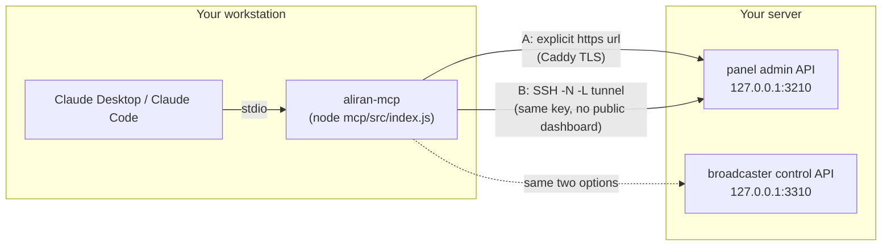
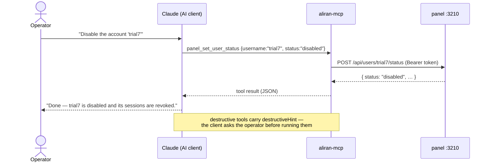

# Quickstart — AI assistant

A step-by-step path from *nothing* to *asking an AI to run your Aliran service*.

Prefer to drive it yourself in a terminal? The
**[terminal quickstart](quickstart-terminal.md)** covers the same ground with Docker
Compose. Both end in the same place — pick one.

For the concepts, the full tool catalog and the security model, see the
[MCP server overview](mcp.md); this page is the hands-on walkthrough. At the end
you'll have the MCP wired into **your MCP client of choice** — Claude Desktop,
Claude Code, Codex CLI, Cursor, VS Code, Windsurf, Cline, Gemini CLI, … — verified
by the built-in **doctor**, and you'll have run your first tool calls.

## What you need

| | Requirement | Notes |
|---|---|---|
| 💻 | Your workstation | Node.js ≥ 20 + git; this is where the MCP server runs |
| 🤖 | An MCP client | **Any** — Claude Desktop, Claude Code, Codex CLI, Cursor, VS Code (Copilot agent mode), Windsurf, Cline, Gemini CLI, … The server is client-agnostic (see [Step 4](#step-4-wire-it-into-your-ai-client-any-mcp-client)) |
| 🖥 | A Linux box (optional) | Only for the `server_*` tools — a VPS you can SSH into with a key. Skip it to manage an already-running deployment over HTTPS |
| 🔑 | Credentials | Panel/broadcaster **dashboard admin** logins (`add-admin`) — or none yet, if `server_install` will create everything |

## Step 1 — Get the code

The MCP server ships inside the Aliran repo (it reads the `docs/` corpus from the
checkout for its `docs_search` tool and resources):

```bash
git clone https://github.com/AbueloSimpson/aliran
cd aliran
npm install
```

## Step 2 — Create your config

The config file is the **only** place secrets live — the AI model never sees it,
only tool results.

```bash
cd mcp
cp config.example.json config.json
chmod 600 config.json          # it holds credentials — keep it owner-only
$EDITOR config.json
```

Decide how the MCP reaches the panel (`:3210`) and broadcaster (`:3310`) — they
bind loopback on the box, so there are two roads:



- **Road A — explicit `url`:** you already publish the dashboards behind
  [Caddy TLS](kb/public-dashboards.md). Put those `https://` urls in the config.
- **Road B — SSH tunnel (default):** omit `url` and the MCP opens an SSH
  local-forward tunnel with the key in `ssh.keyPath`. Nothing public is required.

```jsonc
{
  "panel":       { "user": "admin", "pass": "…" },                  // no url → tunneled
  "broadcaster": { "user": "admin", "pass": "…" },
  "ssh":         { "host": "203.0.113.10", "user": "root",
                   "keyPath": "~/.ssh/aliran_deploy", "port": 22 },
  "install":     { "repoDir": "/opt/aliran" }
}
```

Any of `panel` / `broadcaster` / `ssh` may be omitted — only the tools whose
backend is configured get registered. `user`/`pass` are the **dashboard admin**
logins; if the box is fresh, put the credentials you *want* here and
`server_install` will create those admins for you. Running the
[reseller panel](reseller-panel.md) or the VOD library as well? Optional
`"reseller"` / `"library"` blocks (same shape; tunnel ports `:3330` / `:3320`)
light up the `reseller_*` / `library_*` tool groups — see
[the MCP page](mcp.md#reseller-library-oversight-optional).

## Step 3 — Run the doctor

The built-in onboarding check validates the config, probes every configured
backend, and prints the exact snippet for your AI client:

```bash
node src/index.js --doctor --config ./config.json
```

Sample output (a healthy config):

```text
Aliran MCP doctor
=================
config: /home/op/aliran/mcp/config.json

[ok]   config readable + valid JSON
[ok]   config file mode 600 (owner-only)
[ok]   ssh: connected to root@203.0.113.10
[ok]   panel: /healthz answered via ssh tunnel 127.0.0.1:49802 -> 203.0.113.10:3210 (up:true uptimeSec:9641)
[--]   panel: credential check skipped (re-run with --login to spend ONE real login)
[ok]   broadcaster: /healthz answered via ssh tunnel 127.0.0.1:49807 -> 203.0.113.10:3310 (up:true resuming:false resumed:83)
[--]   broadcaster: credential check skipped (re-run with --login to spend ONE real login)
[--]   reseller: not configured — its reseller_* tools are disabled
[--]   library: not configured — its library_* tools are disabled
[ok]   docs: 43 documents indexed at /home/op/aliran/docs

Enabled tool groups: panel_*  broadcaster_*  server_*  repeater_*  diagnose_*  docs_search
Resources: 43 docs + mcp://aliran/guide
Prompts: 6 guided runbooks (new-site-install, onboard-a-reseller, migrate-a-channel-source, monthly-maintenance, incident-triage, expose-dashboards)

Wire it into your MCP client — any MCP client works; the server is client-agnostic.

JSON ("mcpServers" shape) — Claude Desktop, Cursor, Windsurf, Cline, Gemini CLI:
{
  "mcpServers": {
    "aliran": {
      "command": "node",
      "args": ["/home/op/aliran/mcp/src/index.js", "--config", "/home/op/aliran/mcp/config.json"]
    }
  }
}

Codex CLI — ~/.codex/config.toml:
[mcp_servers.aliran]
command = "node"
args = ['/home/op/aliran/mcp/src/index.js', '--config', '/home/op/aliran/mcp/config.json']

… (the VS Code snippet and the Claude Code / Codex CLI one-liners follow) …

RESULT: all checks passed.
```

The doctor prints every snippet with **your absolute paths already filled in** — Step 4
is mostly copy-paste.

- The default run probes only the **unauthenticated** `/healthz` endpoints, so a
  debugging loop can never trip the login throttle (10 attempts / 900 s). Add
  `--login` once to also verify the credentials with one real login per service.
- Exit codes: `0` all good · `1` a configured backend failed · `2` the config
  itself is unusable — handy in provisioning scripts.

Common doctor failures:

| `[FAIL]` line | Fix |
|---|---|
| `ssh: …` | Wrong `keyPath`/permissions, host unreachable, or the key isn't in the server's `authorized_keys`. Test by hand: `ssh -i <keyPath> user@host echo ok` |
| `panel: … unreachable` (with `url`) | The url is wrong, or the Caddy/site is down. Try `curl https://…/healthz` |
| `panel: … unreachable` (tunnel) | The panel isn't running, or `ADMIN_ENABLED=1` isn't set in `panel/.env` |
| `broadcaster: … unreachable` (tunnel) | `CONTROL_ENABLED=1` missing in `broadcaster/.env` — the control API is off by default |
| `… login failed` (with `--login`) | Wrong `user`/`pass` — create one with `add-admin` (see the [operator guide](operator-guide.md)). Careful: repeated bad logins lock for 15 min |

## Step 4 — Wire it into your AI client (any MCP client)

The Aliran MCP is a standard local-stdio MCP server with **no client coupling** —
you cannot be locked into one vendor's app. Every client below launches it with the
same two facts (`command: node`, `args: [entry, --config, path]`), each in its own
config format. The [doctor](#step-3-run-the-doctor) prints all of these snippets
with your absolute paths filled in.

### The universal JSON shape

Claude Desktop, Cursor, Windsurf, Cline and Gemini CLI all accept the same
`mcpServers` JSON:

```json
{
  "mcpServers": {
    "aliran": {
      "command": "node",
      "args": ["/path/to/aliran/mcp/src/index.js", "--config", "/path/to/config.json"]
    }
  }
}
```

| Client | Where the JSON goes |
|---|---|
| Claude Desktop | **Settings → Developer → Edit Config**, or directly: Windows `%APPDATA%\Claude\claude_desktop_config.json` · macOS `~/Library/Application Support/Claude/claude_desktop_config.json` · Linux `~/.config/Claude/claude_desktop_config.json` |
| Cursor | `~/.cursor/mcp.json` (global) or `.cursor/mcp.json` (per project) |
| Windsurf | `~/.codeium/windsurf/mcp_config.json` |
| Cline | the extension's MCP settings (`cline_mcp_settings.json`) |
| Gemini CLI | `~/.gemini/settings.json` — add the `mcpServers` key |

Then **fully restart** the client (Claude Desktop: quit from the tray/menu-bar icon —
closing the window is not enough). In a new conversation, the client's tools UI
should list **aliran**.

### Codex CLI (OpenAI)

`~/.codex/config.toml` — note the single-quoted TOML *literal* strings, which keep
Windows backslash paths intact:

```toml
[mcp_servers.aliran]
command = "node"
args = ['/path/to/aliran/mcp/src/index.js', '--config', '/path/to/config.json']
```

Recent Codex versions also take the CLI route:

```bash
codex mcp add aliran -- node /path/to/aliran/mcp/src/index.js --config /path/to/config.json
```

### VS Code (Copilot agent mode)

`.vscode/mcp.json` — note the different top-level key and the explicit `type`:

```json
{
  "servers": {
    "aliran": { "type": "stdio", "command": "node",
                "args": ["/path/to/aliran/mcp/src/index.js", "--config", "/path/to/config.json"] }
  }
}
```

### Claude Code

```bash
claude mcp add aliran -- node /path/to/aliran/mcp/src/index.js --config /path/to/config.json
```

### Client differences that matter

- **Destructive-tool confirmations are advisory.** Aliran annotates purges,
  stop/rotate and server updates with the MCP `destructiveHint`, but *honoring* it
  is the client's job — Claude clients prompt before running them; some others
  ignore hints entirely. Verify yours prompts, or phrase destructive intent
  explicitly. The secrets guarantee is client-independent (enforced server-side:
  no tool result ever contains a password or private key).
- **Resources support varies.** Some clients surface MCP *resources*
  (`mcp://aliran/docs/*`), some only tools. That's why `docs_search` is a **tool**:
  docs-grounded answers work in every client either way.
- **107 tools is a large catalog.** Capable models handle it fine; weaker models
  pick tools less reliably — a client consideration, not a server setting.
- Any other MCP client that can launch a **local stdio server** works the same way —
  give it `node` + the two args and consult that client's docs for where they go.

## Step 5 — First conversation

Ask something read-only first — you'll get the client's standard permission prompt
on the first use of each tool:

> **You:** What's the status of my Aliran panel?
>
> **Claude** → calls `panel_status` → `{"users": 12, "streams": 84, "live": 61, "admins": 2}`
>
> **Claude:** Your panel is up — 12 viewer accounts and 84 channels, 61 of them
> live right now. Want me to look at anything specific?

Good first prompts, in escalating order:

1. *"What's the status of my Aliran panel?"* — one read-only call.
2. *"Search the Aliran docs for how backups work."* — `docs_search` + resources;
   answers come from the shipped docs, not model memory.
3. *"List my channels and tell me if any look unhealthy."* — reads across panel +
   broadcaster (`broadcaster_channel_logs` explains a misbehaving source).
4. *"Create a viewer account for maria and give her the sports package."* — a
   write chain (`panel_create_user` → `panel_set_user_packages`); the generated
   password comes back in the result for you to hand over.
5. *"Why does playback stall when many viewers join?"* — `diagnose_symptom` routes
   to the [network-tuning KB](kb/network-tuning.md) and will propose `server_sysctl`.

What a tool call looks like under the hood:



Destructive tools (purges, stop/rotate, `server_update`) are annotated with
`destructiveHint`, so a well-behaved client asks you before running them. The
panel/broadcaster passwords and the SSH key never appear in any tool result.

## Step 6 — Install a fresh server (optional)

With an `ssh` block configured and a bare Ubuntu box, this is the novice-operator
headline: no terminal, ever.

> **You:** Run a preflight check on my server, then install Aliran on it.
>
> **Claude** → `server_preflight` → docker/compose/ffmpeg/git versions
>
> **Claude** → `server_install` → clone → `.env` from examples → build →
> `admin-cli init` → `add-admin` (panel + broadcaster, with your config
> credentials) → writes `PANEL_PUBKEY` / `PUBLISHER_KEY` / `ADMIN_ENABLED=1` /
> `CONTROL_ENABLED=1` into the box's `.env` files → `docker compose up -d`
>
> **Claude:** Installed. Your panel public key (for client builds) is `2f9c…`.
> The publisher key was written directly into the server's broadcaster `.env` —
> it never left the box. Both dashboards are enabled.

The `PUBLISHER_KEY` secret is minted on the box and written to the box; only the
panel **public** key returns through the conversation — that's the
[secrets-stay-local guarantee](mcp.md#the-secrets-stay-local-guarantee).
Afterwards: *"check the server status"* (`server_status`), *"show me the logs"*
(`server_logs`), and later *"update my deployment"* (`server_update`).

## Sharing your setup safely

Writing internal runbooks, or pasting output into an issue? Tool *results* never
contain a password or private key by design, so conversations are safe to share.
Never share `config.json`, a `.env` file, or a terminal showing passwords or keys.
Your panel **public** key is safe to show — it ships inside every client build.
Consider redacting your server hostname/IP and real viewer usernames.

## Troubleshooting

| Symptom | Likely cause → fix |
|---|---|
| `aliran` never appears in your client | Config syntax error (JSON comma / TOML quoting), or `node` not on PATH for GUI apps (macOS: use an absolute node path). Fully quit + restart the client |
| Tools appear, every call fails `unreachable` | The doctor passes but the *server* runs with a different working environment — re-run the doctor with the exact `--config` path from the client snippet |
| `panel rejected the admin credentials` | Wrong dashboard login — `add-admin` on the box, update `config.json` |
| `login throttled` / `locked` | 10 bad attempts / 15 min window. Wait it out; use `--doctor` (healthz-only) while debugging, not `--login` |
| `broadcaster_*` calls fail, `panel_*` fine | `CONTROL_ENABLED=1` missing in `broadcaster/.env` → set it and restart the broadcaster |
| `docs_search` returns nothing | MCP not run from a repo checkout → set `docsDir` in the config |
| A destructive tool ran without asking | Your MCP client ignores `destructiveHint` — the hints are advisory per the MCP spec; prefer a client that surfaces them |

Next: the [MCP server overview](mcp.md) for the full tool catalog and
configuration reference, and the [reference tool table](reference.md#mcp-server-tool-catalog).
