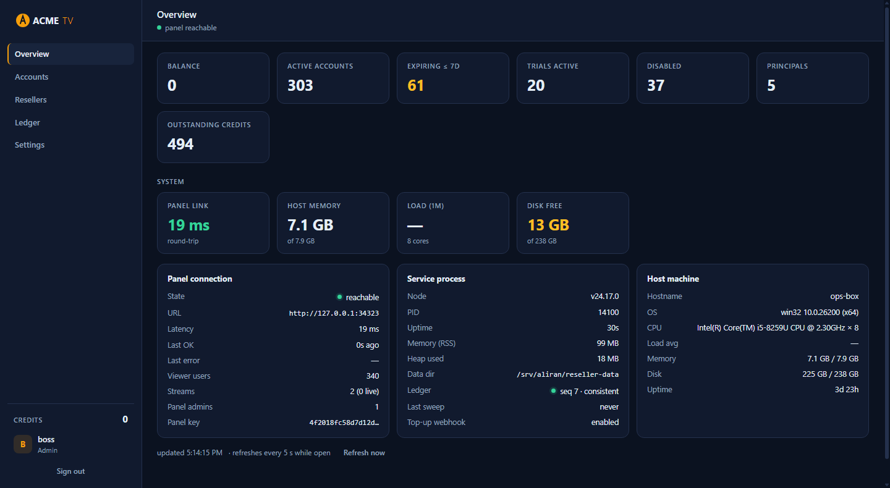
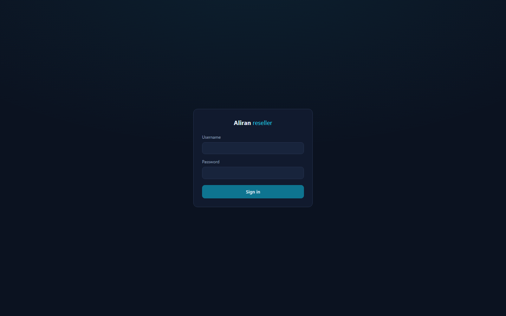
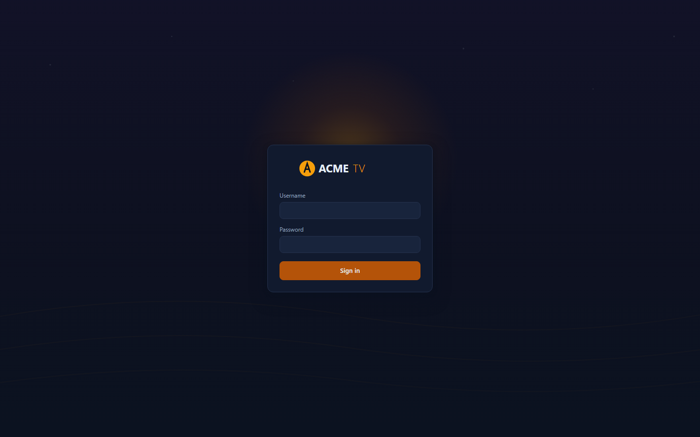
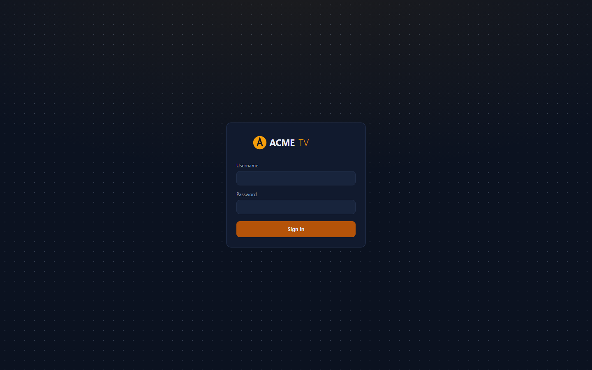

# White-label branding

One codebase, any number of branded apps. A **brand directory** — a service
descriptor plus a handful of images — turns into a release APK with its own:

- Android **applicationId**: `com.aliranclient.<id>`. Branded apps
  **co-install** side by side, and beside the vanilla dev build.
- launcher **icon** + app **name**
- **splash logo**, baked into the APK — it shows before any network I/O
- menu-hub **wallpaper** fallback and Android TV **banner**
- full **color theme** — every token the UI uses; see the descriptor reference

Screens contain no hardcoded brand. Everything flows from the bundled
service descriptor through `makeTheme()`. Packaging a brand never edits
source. The builder swaps the bundled descriptor for one build, then
restores it afterward.

The repo ships one **fictional** example brand, `client/brands/sunburst/`. Real
operator brands are private directories **outside the repo** with the same layout.

## Quick start

```bash
# 1) copy the example brand somewhere private and make it yours
cp -r client/brands/sunburst ../acme && $EDITOR ../acme/service.json

# 2) build a branded release APK (same toolchain as a normal client build)
node tools/brand.mjs ../acme            # or: npm run brand -- ../acme

# 3) install it (or pass --install)
adb install -r client/android/app/build/outputs/apk/acme/release/app-acme-release.apk
```

Prerequisites are exactly those of a normal Android release build: JDK 17
and the Android SDK. See [Client build](client-build.md).

## The brand directory

```
<brand dir>/                 dir name = brand id: 1-24 lowercase letters/digits
                             (it becomes the applicationId suffix; --id overrides)
  service.json    required   the service descriptor baked into the APK — same
                             schema as client/config/service.example.json
  icon.png        required   launcher-icon FOREGROUND: square PNG, transparent
                             background, glyph within the middle ~60% (adaptive-
                             icon safe zone). The background layer is a flat fill
                             of branding.colors.primary.
  logo.png        optional   splash wordmark (transparent background; rendered on
                             branding.colors.brandSurface). Without it the splash
                             shows the service name as text.
  wallpaper.png   optional   menu-hub wallpaper when no featured stream provides
                             a backdrop (panel curation still wins when it does)
  banner.png      optional   Android TV launcher banner, 320x180
  res/            optional   escape hatch: a full Android res tree copied verbatim
                             over the generated overlay (e.g. hand-tuned
                             per-density mipmaps replacing the adaptive icon)
```

`brand.mjs` wires the images up automatically. When `logo.png` /
`wallpaper.png` exist, and the descriptor doesn't already set
`branding.logo` / `branding.wallpaper`, the builder uses the baked
drawables. Those fields also accept `https://` URLs, but only baked art
shows before the network is up.

## Building

```
node tools/brand.mjs <brand> [options]

  <brand>      brand id under client/brands/<id>, or a path to a brand dir
  --dev        borrow panelPubKey / bootstrap / hybrid / dev login from the local
               gitignored client/config/service.json (demo + local testing only)
  --id <id>    override the brand id (default: the dir's basename)
  --variant    release (default) or debug
  --version-code <int>     Android versionCode for this build (fallback: build.json,
                           then the build.gradle default)
  --version-name <string>  Android versionName (same fallback chain)
  --install    adb install -r the APK after a successful build
  --no-build   validate + generate the res overlay, then stop
```

What a build does:

1. **Validates** the brand dir: descriptor sanity, required art, and a hard
   **refusal of any `dev` credentials block** — brand dirs must stay
   shippable.
2. **Generates an Android res overlay** under
   `client/android/app/build/aliranBrand/<id>/res`: app name, adaptive
   launcher icon (your `icon.png` inset 18% over a
   `branding.colors.primary` background), and the splash logo / wallpaper
   / TV-banner drawables.
3. **Swaps** `client/config/service.json` for the brand descriptor. Your
   dev config is backed up and **always restored**, even when the build
   fails. This step also forces a fresh JS bundle, because the React
   Native bundle task doesn't track the descriptor as an input.
4. Runs the **property-gated gradle flavor**
   (`-PaliranBrandId=<id> -PaliranBrandRes=<overlay>` →
   `:app:assemble<Id>Release`). Without those properties, `build.gradle`
   declares no flavors at all, so plain dev/release builds are unaffected.
   With `signing.json` and a version, the builder also passes
   `-PaliranStoreFile`/`-PaliranKeyAlias` and
   `-PaliranVersionCode`/`-PaliranVersionName` — see
   [Shipping to production](#shipping-to-production).

The APK lands in
`client/android/app/build/outputs/apk/<id>/<variant>/app-<id>-<variant>.apk`.

## Desktop player (Windows)

The same descriptor brands the [desktop player](desktop-player.md). Its
screens also render entirely from `branding`: colors become the UI's CSS
variables, and the splash logo, menu wallpaper, and service name come from
the same fields. So a brand's `service.json` carries over unchanged:

1. Copy the brand's `service.json` to `desktop/config/service.json`.
2. Package: `cd desktop && npm run dist`. The descriptor is baked as a
   resource, and the build boots with your panel key and theme (see
   [Desktop player §4](desktop-player.md)).

Two desktop-specific notes:

- **No `brand.mjs` equivalent yet.** You set the installer/exe **icon**
  and **product name** by hand in `desktop/electron-builder.yml` — they
  stay "Aliran" otherwise. Everything *inside* the app is branded with no
  edits.
- The PNG files in a brand dir are Android packaging inputs. For the
  desktop, point `branding.logo` / `branding.wallpaper` at **https URLs**
  in the descriptor. Baked Android drawable references don't exist there.

## Reseller panel dashboard

The [reseller panel](reseller-panel.md)'s web dashboard white-labels **at
runtime, entirely from environment variables**. There is no build step and
no source edits, and changes apply on the next page load. This is the
surface your third-party resellers see, so it is usually the first thing
you rebrand.



### Variables

| Env var | What it does | Served at |
|---|---|---|
| `BRAND_NAME` | Brand text in the login card, the sidebar, and the browser-tab title. Without a logo, it renders like the stock brand: **first word bold**, the rest in the accent tone (for example, "Acme TV" becomes **Acme** `TV`). | `/branding.json` |
| `BRAND_LOGO_FILE` | Path to a logo image. When set, it **replaces the brand text** in the sidebar and on the login card. The name still titles the tab and is the image's alt text. | `/branding/logo` |
| `BRAND_FAVICON_FILE` | Path to a favicon image for the browser tab. Without it, the tab shows a dot in the accent colour, which follows your theme override automatically. | `/branding/favicon` |
| `BRAND_LOGIN_BG_FILE` | Path to a **login-page backdrop image**. It renders full-viewport (cover) behind the login card, with an automatic dark scrim so the card stays readable. This setting wins over `BRAND_LOGIN_STYLE`. | `/branding/login-bg` |
| `BRAND_LOGIN_STYLE` | Built-in login backdrop pattern for when you have no artwork: `glow` (default — a soft accent radial), `plain` (flat background), `grid`, `dots`, or `stripes`. All patterns derive from the theme tokens, so they follow a colour rebrand automatically. Unknown values fall back to `glow`. | `/branding.json` |
| `BRAND_THEME_FILE` | Path to a JSON file that overrides any of the **11 colour tokens** (next section). | `/branding.css` |

All four are optional and independent. Set only what you need. A typical
Docker deployment mounts one read-only brand directory:

```yaml
services:
  reseller:
    volumes:
      - ./acme-brand:/brand:ro
    environment:
      BRAND_NAME: "Acme TV"
      BRAND_LOGO_FILE: /brand/logo.svg
      BRAND_FAVICON_FILE: /brand/favicon.png
      BRAND_THEME_FILE: /brand/theme.json
```

### Images — formats and sizes

Accepted formats (by file extension): **SVG, PNG, JPEG, WebP, ICO**. The
tool refuses any other extension. SVG is the recommendation for the logo,
because it stays crisp at every zoom level. If you use a raster image
instead, supply it at **2× the rendered size**.

| Image | Rendered box (max) | Supply |
|---|---|---|
| Logo — sidebar | **30 px tall × 176 px wide** | SVG, or PNG ≥ 60 px tall, with a **transparent background** (it sits on the `panel` colour). Wide wordmarks work best — the image scales down proportionally to fit the box. |
| Logo — login card | **44 px tall × 250 px wide** | Same file — the login card just allows it larger. |
| Favicon | browser tab (16–32 px) | 32×32 PNG or ICO, or an SVG. |
| Login backdrop | full viewport, `cover`, centre-anchored | **1920×1080 or larger** (or an SVG). An automatic background-tinted scrim dims it, so mid-tone photography works. Keep the centre third calm, since the card sits there, and keep the file lean — about ≤ 500 KB, since it loads on every login view. |

There is one logo slot. The same file is used everywhere it appears. Files
are read per request (`cache-control: no-cache`), so replacing the file on
disk rebrands on the next reload — no restart needed.

The login landing, three ways: stock (the `glow` pattern), an operator
backdrop image (auto-scrimmed, with the logo), and the built-in `dots`
pattern:







### Colours — the 11 theme tokens

`BRAND_THEME_FILE` is a JSON object using any subset of the 11 token
names, in **6-digit hex only** (`#RRGGBB`). The dashboard silently ignores
unknown keys and malformed values. An unreadable file simply means "no
overrides" — a typo can never take the dashboard down.

```json
{
  "bg": "#0B1220",
  "panel": "#111A2E",
  "panel-2": "#18243C",
  "border": "#24314D",
  "text": "#E5EEF7",
  "muted": "#93A4BF",
  "accent": "#F59E0B",
  "accent-dim": "#B45309",
  "danger": "#F87171",
  "ok": "#34D399",
  "warn": "#FBBF24"
}
```

What each token paints. Every other colour in the UI is *derived* from
these via `color-mix`, so overriding a token carries all of its tints with
it:

| Token | Paints |
|---|---|
| `bg` | The page background. |
| `panel` | Sidebar, topbar, cards, table surface, dialogs, popover menus. |
| `panel-2` | One step up: inputs, buttons, hovers, chips, segmented controls. |
| `border` | Card and input borders; table hairlines derive from it at 55%. |
| `text` | Primary text. |
| `muted` | Secondary text: labels, table headers, kv labels, hints, nav idle. |
| `accent` | The brand: accent word/logo tone, active nav bar, links, trial badge, avatar, sort arrows, focus tints, the default favicon dot. |
| `accent-dim` | Fills behind light text: primary buttons, focus outlines. |
| `danger` | Destructive: delete actions, error dots/badges/toasts, negative ledger deltas. |
| `ok` | Healthy: active dots, reachable state, positive ledger deltas. |
| `warn` | Attention: expiring accounts, threshold-crossing System tiles. |

Practical rules:

- **Start with `accent` + `accent-dim`.** For most brands that is the
  whole job — the demo rebrand in the repo history changed exactly those
  two.
- Keep `text` vs `bg`/`panel` at **≥ 4.5:1 contrast** (WCAG AA), and
  `muted` legible on `panel`.
- **Leave `danger`/`ok`/`warn` semantic.** Red/green/amber must keep
  meaning the same thing under every brand — this is the shared-theme
  contract. Adjust their shade, not their hue.
- The dashboard is designed dark. A light theme is possible, since all 11
  tokens are yours, but check row hover, dialogs, and the segmented
  control afterward — the derived tints assume a dark base.

### How it works, and scope

The overrides are served as `/branding.css`, layered **after** the
stylesheet's built-in shared theme block. That block stays byte-identical
across the panel, broadcaster, and reseller dashboards (`npm run
test:theme`), so white-labelling never forks the source. This wires up
the theme seam for the reseller dashboard specifically. The panel and
broadcaster dashboards are operator-internal, and they keep the stock
brand. Rebrand them in source if you must — the same 11 tokens, the same
block — but edit all three sheets, or none.

To read as **one product with your client apps**, align the five core
tokens with your brand descriptor's `branding.colors` (see the top of
this page): `bg` ↔ `background`, `panel` ↔ `surface`, `text` ↔ `text`,
`muted` ↔ `textDim`, `accent` ↔ `accent`. This is the same correspondence
the repo's theme test enforces between the stock dashboard and the stock
app.

## Movies & Series — the external VOD provider

Both apps can show a **Movies & Series** section fed by a third-party VOD
provider the operator already has accounts with. Here are the design
facts a brand needs:

- **The panel owns the switch.** The section exists only while the
  operator has the provider **enabled**. The "VOD provider" card on the
  panel dashboard's Sources tab holds the enable bit and the coordinates —
  you can also set it with `PATCH /api/vod-config`, the `vod-config-set`
  CLI verb, or the MCP tools. Nothing about the provider lives in the
  brand descriptor. A viewer picks up a config change at their **next
  login or app start**, so flipping it on needs **no client rebuild**.
- **Credential pass-off.** The app authenticates to the provider with the
  viewer's own app account: the username as `username`, and the app
  **password** as `token`. The operator provisions matching accounts on
  both sides. The panel stores no provider credential. Be aware of the
  consequence: the provider's playable URLs embed that token as a query
  parameter, over https, so the viewer's app password reaches the
  provider's media servers. Treat provider accounts accordingly.
- **HTTPS-only, enforced client-side.** The app refuses a cleartext
  `apiBase` before dialing, and it never substitutes the token into a
  non-https playable URL.
- **Brand kill-switch.** A brand that never wants the section can set
  `sections.vod: false` in its descriptor. Then the tile never renders,
  even with the panel switch on.
- **Never ship dev credentials.** The gitignored `vod.dev` override in
  `config/service.json` is for local testing only. See
  [Client build](client-build.md#the-vod-block-external-provider-dev-override-only).

### Movies and Series — per-kind sources

The provider config carries one source name per catalog kind:
`sources.movies` and `sources.series`. With only a movies source set, the
apps show movies and keep Series honestly empty. Setting a series source —
with `vod-config-set --series-source <name>`, the `sources` map on
`PATCH /api/vod-config`, or the dashboard card's field — lights up series
browsing: a grid, a detail page with seasons and episode lists, and
episode playback. This happens at the viewer's next login, again with no
client rebuild. One provider download feeds both kinds plus the genre
names, so enabling series adds no extra provider traffic.

### What the section looks like

Both apps render the same browse structure. The strings are in English
and are not themeable beyond the normal color tokens. The layout is: a
left menu (**Movies / Series / Search** — search is its own view), a tab
bar (**Recommended · My List · Genres · All**), and a sort menu (Recently
added · A-Z · Newest releases · Oldest releases · Recently watched) behind
an always-visible "Sort by" chip. The alphabetical sort adds a vertical
A–Z jump rail. Genre cards come from the provider's own category names.
Recommended shows one-row "Recently added" and "Newest releases" rails.
Titles resume where the viewer left off, and the VOD players offer the
same audio/subtitle track selection as live playback.

### My List and watch history stay on the device

The watchlist ("My List") and the watch history that powers *Recently
watched* and resume are stored **only in the app's local preferences file
on the viewer's device**. They are never sent to the panel, the provider,
or anywhere else. The operator cannot see them, and neither can you.
Uninstalling the app, or clearing its data, erases them. If you write
your own privacy copy, you can state this plainly.

## Send to TV, and the cast receiver

Three cross-device features ship behind build flags rather than brand
data, so a brand that does not want them simply does not turn them on.
`remote: { sendToTv }` gives a phone the ability to sign a television in;
`remote: { control }` gives "play on my TV"; `remote: { keepSignIn }` lets
a television keep a handed-over sign-in across restarts. All three are off
unless a build names them, and a build that names none of them joins no
rendezvous and keeps nothing (the `remote` option in §3 of
[the SDK guide](sdk-guide.md)).
Casting is the host app's own decision in the same way: the LAN server
exists only while the app has asked for a cast session.

**The cast receiver carries Google's branding, not yours.** The shipped
path uses the stock **Default Media Receiver** (`CC1AD845`), which is why
an operator needs no Google registration, no fee and no hosted receiver
page. If you want the "loading" screen on the television to carry your own
logo, register a receiver application id of your own with Google and give
it to your sender — the bytes the SDK serves do not change, only the page
the television shows around them.

## Keys and credentials

- **`panelPubKey` is public.** It ships inside every APK, like the
  branding. Set your panel's key in the brand descriptor for real builds.
- **Credentials are not brand data.** `brand.mjs` rejects a descriptor
  carrying a `dev` login block. For a local demo build against your own
  panel, `--dev` merges the missing deploy-time values — including the
  dev auto-login — from your gitignored `client/config/service.json` at
  build time. Nothing lands in the brand dir.

## Shipping to production

### Sign releases with a per-brand key

Without a signing configuration, `brand.mjs` signs release builds with
the **public RN debug keystore**, and prints a warning. A debug-signed
build is fine for demos. It is **not shippable**. Android installs an
update only when the update has the same signature as the installed app.
So a debug-signed install can never receive a
[P2P OTA update](app-updates.md) from a correctly signed build. Sign
every release of a brand with the same private key, from the first
shipped APK on.

Set up signing one time per brand:

1. Generate a keystore in the brand directory:

   ```bash
   keytool -genkeypair -v -keystore ../acme/release.keystore \
     -alias acme -keyalg RSA -keysize 2048 -validity 10950
   ```

2. Add `signing.json` next to it:

   ```json
   { "keystore": "release.keystore", "keyAlias": "acme" }
   ```

3. Set the two password variables, then build:

   ```bash
   export ALIRAN_STORE_PASSWORD='...'
   export ALIRAN_KEY_PASSWORD='...'
   node tools/brand.mjs ../acme --version-code 5 --version-name 1.1.0
   ```

`signing.json` holds **no passwords**. The builder refuses a
`signing.json` that contains a password field. The passwords come only
from the environment. The builder checks the keystore file, the key
alias, and both variables before it starts gradle. At the end it prints
the `applicationId`, `versionCode`, and `versionName` — the values you
need when you [publish the APK as an update](app-updates.md).

### Guard the key

- **Keep the keystore and the passwords out of git.** Real brand dirs
  live outside the repo. Keep them there, especially once a keystore is
  inside.
- **Back the keystore up in private storage.** If you lose it, no future
  build can update the installed fleet. Every device then needs a manual
  reinstall.
- **Do not share the keystore.** The holder of the key can sign updates
  that your installed apps accept.

### Safe backup in a private git repository

A private repository is a good backup location — but only for an
encrypted copy. Repository access alone must not give a person your
signing identity.

1. Use a long random keystore password (20 or more characters, from a
   password manager). The keystore file is an encrypted container. Its
   strength is the strength of this password.
2. Encrypt the keystore file one more time, with a different passphrase:

   ```bash
   openssl enc -aes-256-cbc -pbkdf2 -iter 600000 -salt -in release.keystore -out release.keystore.enc
   ```

3. Commit only the `.enc` file. Never commit the plain keystore.
4. Keep both passwords in a password manager. Do not keep them in any
   repository, and do not keep them in a file beside the `.enc` file.

To restore the keystore on a new machine:

```bash
openssl enc -d -aes-256-cbc -pbkdf2 -iter 600000 -in release.keystore.enc -out release.keystore
```

If you rotate the keystore, encrypt and commit the new file. Keep the
old `.enc` file as long as one installed device still uses the old key —
that key is the only key those devices accept. Record its passphrase in
your password manager. Remove an old `.enc` file only when no installed
device depends on its key.

### Version each release

Increase `versionCode` on every release — installed apps only offer an
update with a higher `versionCode`. Set the version with the
`--version-code` / `--version-name` flags, or put defaults in an
optional `build.json` in the brand dir:

```json
{ "versionCode": 5, "versionName": "1.1.0" }
```

The flags win over `build.json`. Without either, the build uses the
shared defaults in `client/android/app/build.gradle`. Those defaults are
not per-brand, so pass a real version for every shipped build.

### Official public builds

The stock keyless APK uses the same property-gated gradle plumbing,
without `brand.mjs`:

```bash
export ALIRAN_STORE_PASSWORD='...'
export ALIRAN_KEY_PASSWORD='...'
cd client/android
./gradlew :app:assembleRelease \
  -PaliranStoreFile=/secure/aliran-public-release.keystore \
  -PaliranKeyAlias=public \
  -PaliranVersionCode=5 -PaliranVersionName=0.6.0
```

Official public builds must be release-signed with the **project-held
public-build keystore**. That keystore lives in the project's private
ops storage. It is never in the repo. This signature is what makes
operator re-hosting of public builds tamper-proof: a paired device
accepts an update only from the same signer.

### One generic APK instead

If you prefer a single unbranded binary, the public keyless flavor takes
the descriptor at runtime: first run shows a **Connect screen** where
the viewer enters your panel key and account. See
[Client build](client-build.md). Brand packaging exists for the opposite
goal: a store listing that *is* the operator's product.
